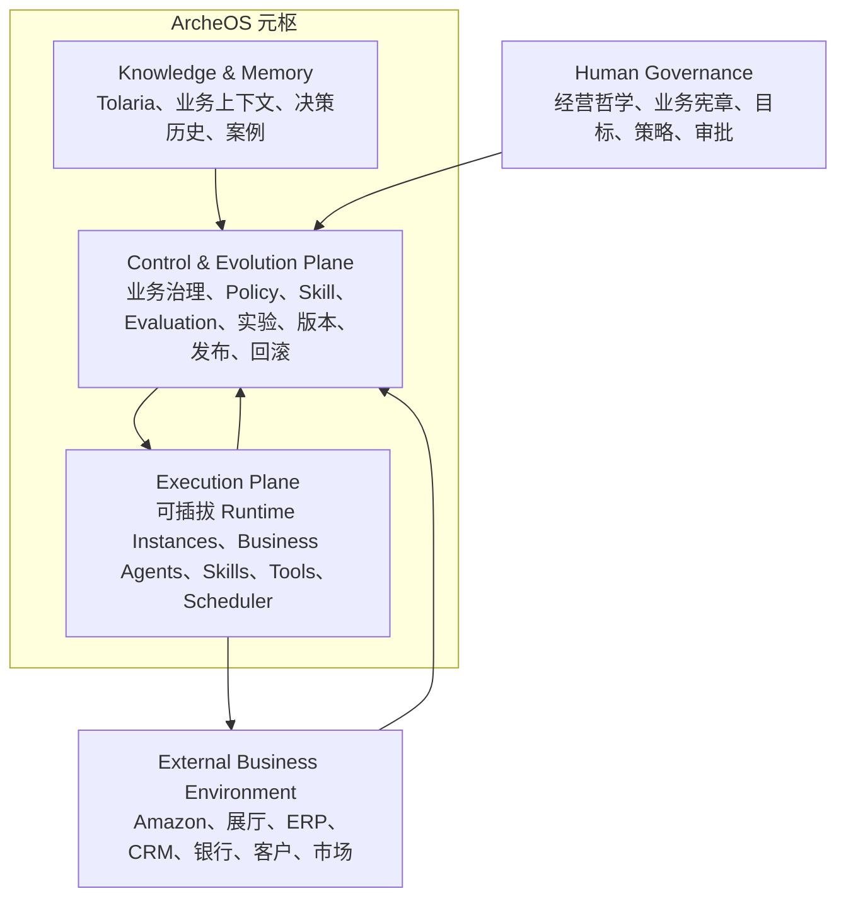
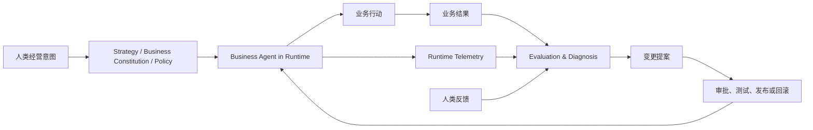

# ArcheOS 系统架构

## 架构原则

1. ArcheOS 的产品架构与任何特定开发工具无关。
2. Coding Agent、IDE、人工开发者都属于系统外部的开发方式。
3. 业务 Agent Runtime 可以作为 ArcheOS 的可插拔执行面。
4. 外部业务系统不属于 ArcheOS，但向其提供业务数据和反馈。
5. ArcheOS 关注经营方向、Agent 业务表现、能力治理与持续演化。

## 宏观结构

## 核心反馈闭环

## 模块边界

| 模块 | 负责 | 不负责 |
|---|---|---|
| Human Governance | 经营哲学、目标、策略、风险偏好、审批和最终裁决 | Runtime 技术执行 |
| Control & Evolution Plane | 观察业务表现，治理 Policy、Skill、Evaluation、实验、版本与发布 | 直接代替业务 Agent 执行任务 |
| Execution Plane | 承载 Runtime、业务 Agent、Skills、Tools、Scheduler 和运行状态 | 定义企业经营哲学 |
| Knowledge & Memory | 保存业务上下文、决策历史、案例和长期记忆 | 直接执行业务动作 |
| External Business Environment | 产生业务事件、数据和最终结果 | 成为 ArcheOS 内部模块 |

## Source of Truth

| 内容 | 主要事实源 |
|---|---|
| 经营目标、业务宪章、重大策略与审批 | ArcheOS Control Plane + 决策记录 |
| 业务事实、会议、案例和上下文 | Tolaria / 业务数据源 |
| Skill、Policy、Evaluation、Schema 和发布版本 | ArcheOS 仓库或受治理的资产库 |
| Agent 执行状态与运行轨迹 | Runtime Telemetry |
| 销售、利润、现金流、库存等业务结果 | 外部业务系统 |
| 开发过程和代码变更历史 | 版本控制系统；不属于产品运行架构 |

## 开发工具边界

ArcheOS 可以由任何人工开发者、IDE 或 Coding Agent 开发。开发工具只参与仓库变更，不属于 ArcheOS 的 Control Plane、Execution Plane、Runtime 或领域模型。系统文档和接口不得依赖某个具体开发工具。
