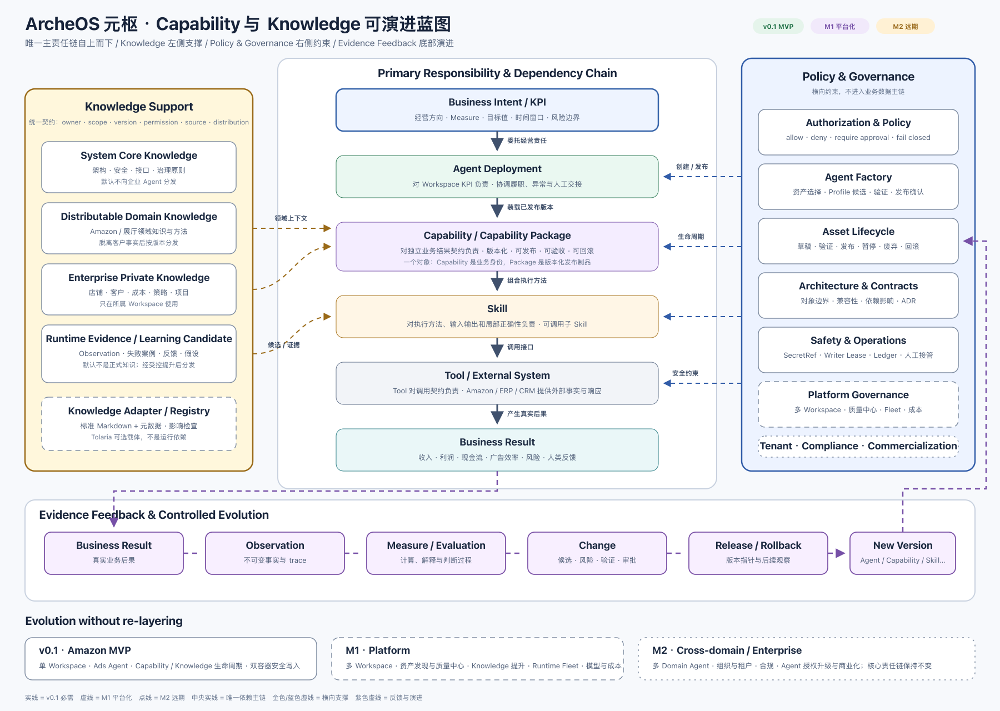

# ArcheOS 系统架构

## 架构状态

- Version: `0.5.0`
- Status: `approved`
- Upstream: `AR-PRD@0.6.0` approved
- Previous approved rollback baseline: Architecture `0.3.0`
- Decision: `ADR-0004`

本版本依据已批准 PRD v0.6.0 重建 Capability、KPI、Knowledge 和 Tolaria 边界。Leo 于 2026-07-12 正式批准 Architecture v0.5.0 与 ADR-0004；该批准允许 Roadmap 进入独立重审门禁，但不批准 Roadmap、Milestone、Issue 或实现。

## 可演进蓝图



可编辑源文件：[archeos-capability-knowledge-blueprint.svg](./attachments/archeos-capability-knowledge-blueprint.svg)

### 读图方式

- 中央实线从上到下是唯一主依赖与责任链。
- 左侧 Knowledge 是上下文支撑，不在主依赖中冒充执行层。
- 右侧 Policy / Governance 是约束和生命周期控制，不进入业务数据主链。
- 底部紫色虚线是独立反馈链，不把反馈画成反向依赖。
- 实线模块属于 v0.1；虚线模块属于平台化阶段；点线模块属于远期演进。

## 唯一主责任链

```text
Business Intent / KPI
        ↓ 委托
Agent Deployment
        ↓ 装载
Capability Package
        ↓ 组合
Skill
        ↓ 调用
Tool / External System
        ↓ 产生
Business Result
```

| 节点 | 负责 | 不负责 |
|---|---|---|
| Business Intent / KPI | 定义经营方向、目标值、窗口、风险和最终决策权 | 规定执行方法 |
| Agent Deployment | 对具体 Workspace KPI 履职；协调 Capability、异常和人工交接 | 把局部能力达标等同整体 KPI 达标 |
| Capability Package | 对可独立承诺和验收的业务结果契约负责 | 承担某个客户的最终 KPI；保存运行状态 |
| Skill | 对执行方法、输入输出和局部正确性负责 | 承担完整业务职责 |
| Tool | 对调用契约、错误、权限和幂等语义负责 | 作复杂经营判断 |
| External System | 提供外部事实并接收动作 | 成为 ArcheOS 内部模块 |
| Business Result | 表达真实业务后果 | 自动证明目标已经实现 |

责任向上汇总但不能向下转移。Agent KPI 必须可追溯至贡献它的 Capability Package、Skill、Tool 调用以及 Observation/Measure 证据。

## Capability 架构

### 一个对象，两种表达

Capability 与 Capability Package 不建立重复实体：

- `Capability` 是稳定业务语义和身份；
- `Capability Package` 是该 Capability 的不可变版本化发布制品；
- 共享 `capability_id`、版本谱系、生命周期、依赖和审计记录。

平台创建、验证、发布、暂停和回滚的是 Package 版本；经营者和 Agent 识别的是 Capability 业务职责。

### 最小结果契约

每个 Capability Package 至少声明：

```yaml
capability_id: amazon-ads-optimization
version: 1.0.0
business_outcome: 在经营目标和安全边界内改善广告投入效率
scope: amazon-ads
owner_role: platform-manager
responsibilities: []
non_responsibilities: []
inputs: []
outputs: []
preconditions: []
skills: []
tool_requirements: []
knowledge_requirements: []
policies: []
measures: []
success_thresholds: []
evidence_requirements: []
permissions: []
approval_requirements: []
compatible_versions: {}
acceptance: []
failure_impact: []
rollback_target: capability://amazon-ads-optimization@0.9.0
```

同一 Package 更换兼容 Skill 时可以保持结果契约版本；改变业务结果、适用范围、前置条件或验收语义时必须发布新的不兼容版本并重新批准。

v0.1 由 Agent Deployment 组合多个 Capability Package；Capability Package 组合 Skill，不嵌套其他 Capability。

## Skill、Tool 与 Ops Kit

- Skill 是方法，可调用 Tool 或子 Skill；顺序、分支、循环、并行和人工交接属于复合 Skill 内部编排。
- Tool 是 Runtime 的底层调用接口；Amazon Ads API、SP-API、数据库、文件和模型服务通过 Tool Adapter 接入。
- Amazon Ops Kit 是内部 Amazon 执行内核和领域资产来源，提供 Agent Port、数据契约、策略、受控写入、调度、审计、自检和分发实现。
- Ops Kit 的实现按来源版本和 digest 登记为 Capability Package 的 Skill/Tool/Policy/Measure 依赖；不把 Ops Kit 内部对象自动提升为 ArcheOS 核心对象。
- 店铺经营者只使用 ArcheOS 统一体验；Ops Kit 不拥有经营目标、用户权限、审批、Agent 生命周期或最终产品状态。
- Ops Kit 不可用或不兼容时，相关 Capability Package 与 Agent Deployment 进入受限或阻塞状态，不能静默切换未知实现。

## Knowledge 横向支撑

Knowledge 不属于主执行层，但可以被 Agent Deployment、Capability Package 和 Skill 引用。

| 分类 | 主要用途 | 分发边界 |
|---|---|---|
| System Core Knowledge | 架构、安全、接口和治理原则 | 系统级；默认不向企业 Agent 分发 |
| Distributable Domain Knowledge | Amazon、展厅等跨企业领域知识 | 可随领域资产或 Capability Package 分发 |
| Enterprise Private Knowledge | 店铺、客户、成本、策略、项目、会议 | 只在所属 Workspace 使用 |
| Runtime Evidence / Learning Candidate | 运行事实、失败案例、反馈和改进候选 | 默认不是正式 Knowledge；受控提升后才可分发 |

所有 Knowledge 使用统一元数据：`knowledge_id`、分类、所有者、作用域、版本、摘要、权限、来源、分发规则、状态和依赖影响。

- 正式 Knowledge 生命周期：`草稿 → 评审中 → 已批准 → 已发布 → 已暂停 → 已废弃`；
- Runtime Evidence / Learning Candidate：`已记录 → 待筛选 → 已拒绝 / 已提升候选`，不与正式 Knowledge 状态混用。

受控提升链：

`企业私有知识或学习候选 → 所有者授权 → 脱敏 → 抽象 → 验证 → 人工批准 → 可分发领域知识新版本`

Tolaria 只通过 Knowledge Adapter 读写标准 Markdown 与元数据。它不是 ArcheOS 模块、核心对象、语义事实源或运行依赖。发布时解析 Knowledge 的精确版本与摘要；Tolaria 不可用时，已发布 Agent 继续使用已分发制品。

## Policy 与 Governance 横向控制

Policy 横向约束 Agent Deployment、Capability Package、Skill 和 Tool 调用；Governance 管理资产的架构、验证、版本、发布、暂停、废弃、影响和回滚。

Control Plane 至少包括：

- Authorization：principal、active role、Workspace、action、resource 和 Policy 决策；
- Agent Factory：由已发布 Capability Package、Knowledge、Policy 和 Runtime profile 生成 Agent Profile 候选；
- Asset Lifecycle：草稿、验证中、可发布、已发布、已暂停、已废弃；
- Change Control：风险分类、验证、审批、发布、观察和回滚；
- Operations：异常、通知、人工接管、证据保留、导出和恢复；
- Writer Coordination：写入者租约、fencing token 和确定性 Write Ledger。

Business Cockpit 是同一产品中的交互外壳。平台管理者与店铺经营者的服务端权限必须独立执行，前端隐藏按钮不构成安全边界。

## 独立反馈链

```text
Business Result
      ↓ 记录
Observation
      ↓ 计算与判断
Measure / Evaluation
      ↓ 形成候选
Change
      ↓ 验证、审批、发布或回滚
Agent / Capability Package / Skill / Policy / Knowledge 新版本
```

- Observation 是不可变事实；
- Measure 是稳定计算与解释定义；
- Evaluation 是使用 Measure、Policy 和证据作出判断的过程，不建立一级对象；
- Change 是唯一受治理的演进单位；
- 运行证据不会自动成为正式 Knowledge、Policy 或 Capability。

## 关键接口

| 接口 | 上游 | 下游 | 关键语义 |
|---|---|---|---|
| KPI Assignment | Business Intent | Agent Deployment | Measure、目标、窗口、约束、责任状态 |
| Agent Port | Control Plane | Runtime / Agent | task、context refs、result、trace、status |
| Capability Contract | Agent Deployment | Capability Package | 结果、适用范围、前置条件、调用、验收、失败影响 |
| Skill Contract | Capability Package | Skill | 输入、输出、错误、依赖、权限、测试 |
| Tool Contract | Skill | Tool / External System | 请求、响应、权限、幂等、readback |
| Knowledge Contract | Knowledge Adapter / Registry | Agent / Capability / Skill | 分类、版本、摘要、权限、来源、分发 |
| Policy Decision | Governance | Agent / Capability / Skill / Tool | allow、deny、require-approval、reason |
| Observation Contract | Runtime / External System | Evidence Store | source、time、subject、payload digest、trace |
| Change Contract | Evidence / Governance | Versioned assets | diff、risk、validation、approval、release、rollback |

## v0.1 业务切片

v0.1 只实现 Amazon Ads 单 Workspace 垂直切片，但不绕过稳定接口：

1. 店铺经营者设置经营导向和 KPI；
2. Agent Factory 选择已发布的 Amazon Ads Capability Package，生成 Agent Profile 候选；
3. 平台管理者核对结果契约、资产版本、权限、Knowledge、Schedule、Runtime 和回滚目标后发布；
4. Agent Deployment 装载 Capability Package，通过 Ops Kit Skill/Tool 完成读取、诊断、候选、授权写入和复盘；
5. 写入经过服务端 Authorization、店铺审批边界、单写入者租约和 Write Ledger；
6. Business Result 进入 Observation、Measure/Evaluation 和 Change 闭环；
7. 第二容器使用相同发布制品和独立 SecretRef，在原容器不可用时独立运行且不重复写入。

## 安全与故障不变量

- 配置只保存 SecretRef；秘密不进入 Agent Package、Knowledge、日志、Observation、Change diff 或导出证据。
- 相同写入范围的 Runtime 使用带 fencing token 的单写入者租约，并使用确定性 Write Ledger 去重。
- Authorization、Writer Coordination、Secret Provider 或关键证据持久化不可用时停止新写入；可信读取和分析可以只读降级。
- 故障期间积压写入不自动补执行；恢复前必须重新验证并由店铺经营者明确恢复。
- 运营证据默认至少保留 90 天；版本、审批、发布、撤销和高风险写入证据在 v0.1 持续保留。
- 任何改变 Amazon 写入方法、参数或范围的 Change 必须事前人工审批；读取/分析改变可受限自动验证，但必须版本化、留痕和可撤销。

## 演进阶段

| 阶段 | 交付边界 | 保持不变的内核 |
|---|---|---|
| v0.1 Amazon MVP | 单 Workspace、Amazon Ads Agent、Capability Package 生命周期、Knowledge 四分类、双容器、安全写入和反馈闭环 | 主责任链、横向支撑、稳定接口 |
| M1 平台化 | 多 Workspace、资产发现与依赖、质量中心、Knowledge 提升、Runtime fleet、模型与成本治理 | 同一对象语义；增加治理规模，不增加伪层级 |
| M2 跨领域 / 企业交付 | 多 Domain Agent、组织角色、租户隔离、合规、Agent 授权升级与商业化 | Capability 和 Knowledge 可跨领域扩展；Amazon 特例保持在 Domain Adapter |

蓝图节点是逻辑模块，不要求一一拆成独立服务。M1/M2 不构成 v0.1 暗含承诺。

## Source of Truth

| 内容 | 主要事实源 |
|---|---|
| 产品范围、用户结果和验收 | `docs/product/product-brief.md`、`docs/product/prd.md` |
| 核心对象语义 | `docs/architecture/object-boundaries.md` |
| 模块、接口和反馈闭环 | 本文件 |
| 架构取舍、迁移和回滚 | `docs/decisions/` |
| 工件版本、摘要、依赖和审批状态 | `governance/manifest.json` |
| Capability、Skill、Tool、Policy、Measure、Knowledge 发布制品 | ArcheOS 受治理资产库 / Git |
| 企业私有事实 | Workspace 数据源和企业私有 Knowledge |
| Agent 状态、业务结果与证据 | Runtime Telemetry、Observation、外部业务系统 |
| Tolaria 内容 | Markdown 管理载体；通过 Knowledge Adapter 接入，不是核心语义事实源 |
| Amazon Ops Kit 实现 | Ops Kit 发布制品及其来源版本/digest；不是 ArcheOS 核心事实源 |

## 迁移与下游影响

- 删除 Capability View 正式术语；历史 UI 投影直接改为展示真实 Capability Package 及 Agent 当前状态。
- 旧 Capability 内容按结果契约判断：满足条件则迁移为 Capability Package；否则归类为 Skill、Tool、Policy、Measure、Knowledge 或质量门禁。
- 旧 Protocol 内容继续分类为 Policy、Skill、Knowledge 或流程文档。
- Tolaria 引用迁移为 Knowledge 元数据与 Adapter 来源；不要求迁移或删除原 Markdown。
- Amazon Ops Kit 保持独立实现仓库，通过版本化 Domain Adapter/资产引用接入，不复制源码或店铺事实。
- Roadmap 保持 `stale`，必须在本架构批准后由交付负责人重新评审；Milestone、Issue 和 Implementation 保持 blocked。
- `apps/business-cockpit/` 只有在 ready Issue 后才能实现术语和界面迁移。

## 开放风险

1. Capability 结果契约的兼容性判定需要 Schema 和契约测试验证；不能只靠版本号约定。
2. Amazon Ops Kit 现有 Capability Matrix 与新的 Capability Package 边界尚需逐项盘点，不能机械一行对应一个 Package。
3. Knowledge 脱敏、抽象和提升质量需要人工批准与领域评价，v0.1 只验证一条闭环。
4. Writer Lease 在网络分区和协调服务故障下的 fencing 行为仍需实现级验证。
5. 多 Workspace、组织角色、成本治理和商业化属于后续产品范围，不得提前固化服务拆分。
