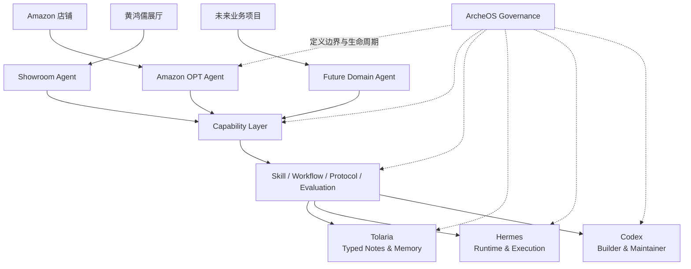
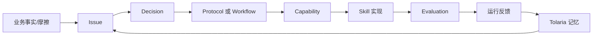

# ArcheOS 系统架构

## 宏观结构

## 关键判断

ArcheOS 不是一个统一吞并所有工具的软件。它首先是：

1. 一套稳定的抽象模型；
2. 一套跨工具治理协议；
3. 一套能力依赖与评价体系；
4. 一套让业务经验可逐级固化的工程方法。

## 业务到能力的闭环

## Source of Truth 分配

| 内容 | 主要事实源 |
|---|---|
| 业务事实、会议、案例、决策背景 | Tolaria |
| 稳定架构、Schema、规范、代码 | 本仓库 |
| Agent 的执行状态与运行日志 | Hermes / Runtime |
| 代码变更与实现历史 | GitHub |
| 指标结果 | 业务数据源 + Evaluation 输出 |
