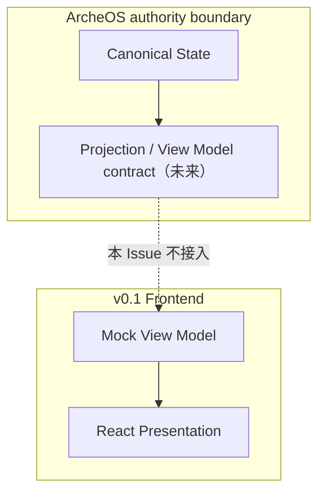

# ArcheOS 决策工作台 Frontend Architecture v0.1.0

## 1. 架构目标

建立一个可复用、可深链接、完全由 mock View Model 驱动的 React Human View。它验证 Presentation 与交互，不接 ArcheOS runtime，不改变 canonical Core，也不为未来 backend 预设错误 contract。

## 2. 系统边界



v0.1 只实现 `Mock View Model → React Presentation`。虚线不表示 runtime integration 已存在。

## 3. 技术方向

- React + TypeScript；
- Vite 作为本地开发与静态构建工具；
- `@xyflow/react` 承担可缩放、可聚焦、可交互的关系图；
- 固定布局图与财务图优先使用可访问的 SVG / CSS；若实现 Issue 证明需要成熟 chart library，再在 Issue 中完成 reuse-first 依赖选择；
- 不引入 backend SDK、API client、状态同步、认证、数据库或部署平台。

旧 `sunward-operating-system` 只复用 React Flow 交互经验、视觉语言和布局启发，不复制其旧数据模型、API、Review Center authority 或 canonical state。

技术依赖的精确版本、license、维护状态和 rollback 由后续实现 Issue 锁定；本架构不把“旧仓库正在使用”当成唯一选型依据。

## 4. 前端模块

```text
frontend/
  src/
    app/                  # Shell、URL、View 切换、错误边界
    features/
      workbench/          # 左侧推进栏 + 向阳总图
      principle-world/    # 笃善科技理念世界 v1
      finance-world/      # 财务三表
      people-world/       # 完整人脉图 + Person 档案
      organization-world/ # 组织与治理图
      work-branch/        # Project / Business Line 共用节点与详情
      record-detail/      # 业务详情 + Decision / Evidence / Source 链接
    view-model/
      types.ts            # Presentation-only 读取类型
      mock/               # 稳定 mock fixtures
    shared/
      graph/              # 图节点、边、焦点路径与可访问性
      ui/                 # 侧栏、状态、导航、图例
      theme/              # 向阳视觉 token
```

模块名是代码组织，不创建 Core Module / Object truth。

## 5. URL 与详情策略

建议路由：

```text
/workspaces/dushan
/workspaces/dushan/assets/principles
/workspaces/dushan/assets/finance
/workspaces/dushan/people
/workspaces/dushan/people/:personId
/workspaces/dushan/organizations/:companyId
/workspaces/dushan/projects/:projectId
/workspaces/dushan/business-lines/:businessLineId
/workspaces/dushan/issues/:issueId
```

- 大型图使用全屏 route；
- 小信息使用侧栏；
- node 通过普通链接实现，保留浏览器新标签页行为；
- URL 使用稳定 mock ID；未来接 backend 时替换 provider，不改用户导航语义；
- 总图焦点、缩放与左侧筛选保存在 URL query 或 history state，返回时恢复。

## 6. View Model 边界

Presentation 只读取以下类别：

- Workspace header；
- Vision / values；
- asset nodes 与展示依赖；
- Project / Business Line / Milestone / Issue / Todo projections；
- Person / Company profile projections；
- Decision / Evidence / Source link projections；
- 状态、缺失和候选标记。

禁止：

- 让 mock type 反向成为 Core schema；
- 保存独立的 Roadmap / Asset / Branch truth；
- 在前端推断或持久化 canonical Relationship；
- 通过 UI label 新增 Role / Relationship / Lifecycle；
- 把 Tree layout 写回为唯一 hierarchy。

Project / Business Line 的 Presentation projection 使用同一组件契约，并保留最小语义差异：

```ts
type WorkBranchProjection = {
  role: 'project' | 'business_line'
  lifecycle: 'bounded' | 'ongoing'
}
```

- fixture 默认值是 `project` 与 `bounded`；
- 只有用户明确指定，或无法定义可信完成条件的持续经营责任，才使用 `business_line` 与 `ongoing`；
- 不依据“时间较长”“重复发生”或“Milestone 较多”自动推断 ongoing；
- 两种 route 复用同一页面组件，但不把 route 合并成新的 Core noun；
- 第一版不为了状态覆盖而人为增加 ongoing fixture。

## 7. 推进关系投影

唯一 ownership：

```text
Workspace → Roadmap → Milestone → Issue → Todo
Project   → Milestone → Issue → Todo
```

Business Line detail 可以查询并展示相关 Roadmap / Milestone / Issue，但结果必须标为关联 View，不创建 ownership edge。Project detail 不显示内部 Roadmap 容器。

该 ownership 差异由 View Model provider 负责提供；共用组件不得把视觉一致误写成语义一致。

## 8. 人类界面边界

最终页面只显示：

- 业务名称与状态；
- 图形关系；
- 当前重点与下一动作；
- “相关决定”“查看依据”“查看原文件”等业务链接；
- “待确认”“资料待补充”等必要状态。

以下内容只留在 docs / Issue / developer tooling：

- 为什么选择树或特定 chart；
- canonical concept 映射；
- schema、ID、provider、adapter、Projection 等实现术语；
- Stage Gate、Roadmap Alignment、Concept Convergence；
- mock 与 backend 的技术差异说明。

## 9. 验证边界

后续实现 Issue 至少需要：

- TypeScript typecheck；
- production build；
- 关键交互自动测试：事项定位、资产 route、人脉非中心关系、Person 档案、追溯链接；
- 1440×900 桌面截图与交互走查；
- keyboard focus 与 reduced-motion 检查；
- 静态检查证明没有 fetch / backend client / 正式数据路径；
- 静态或单元检查证明默认 fixture 为 `project + bounded`，且 Project / Business Line 共用组件；
- 与旧向阳前端的复用只发生在交互和视觉层。

## 10. 后续 backend 接入条件

以下条件全部满足前不得接 backend：

1. v0.1 mock UI 获得产品验收；
2. canonical read contract 已由独立 Issue 批准；
3. production-shaped fixture 覆盖缺失、候选、冲突、空数据与失败状态；
4. View Model 不要求 Core 新增平行 truth；
5. backend integration 具有独立 branch / PR / rollback。
