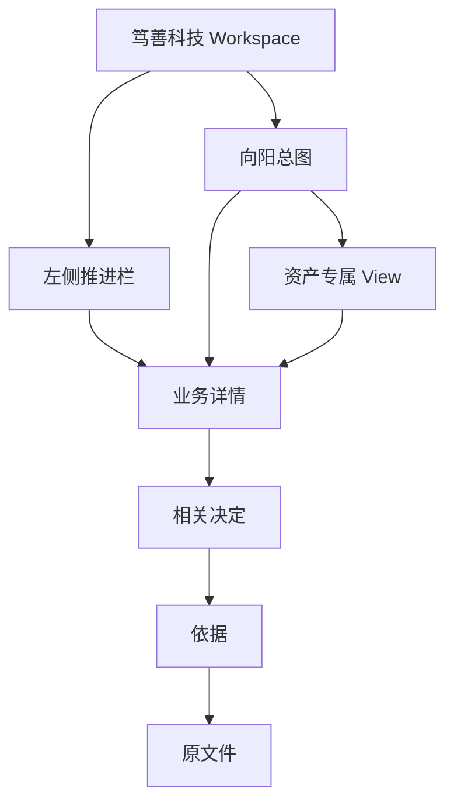
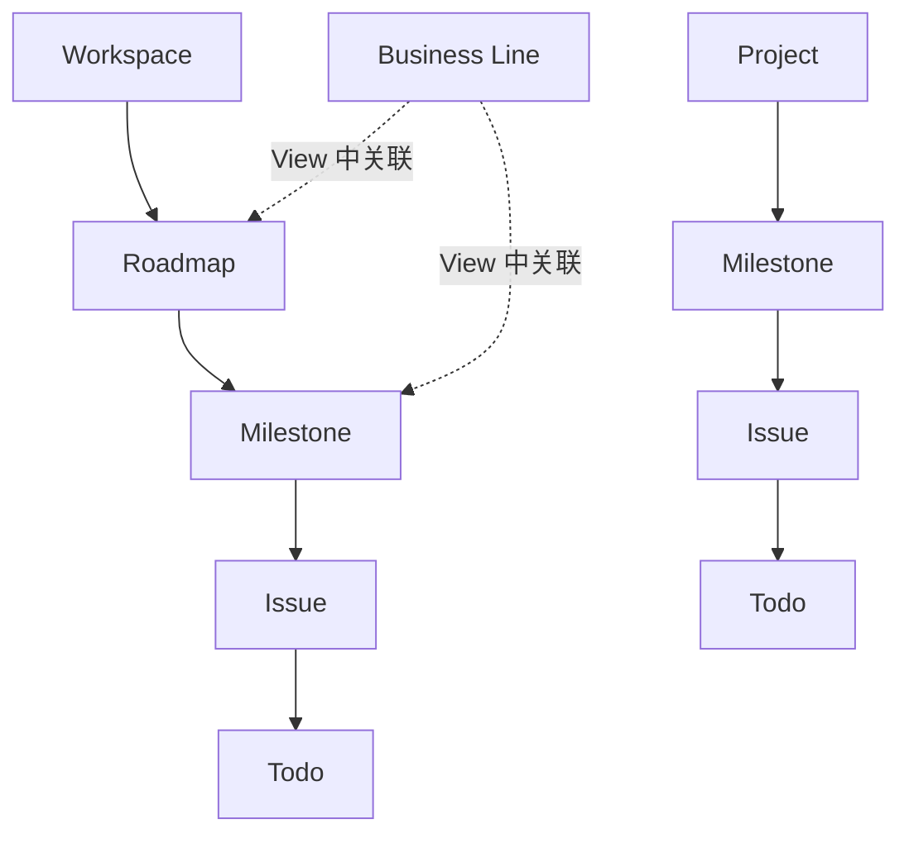
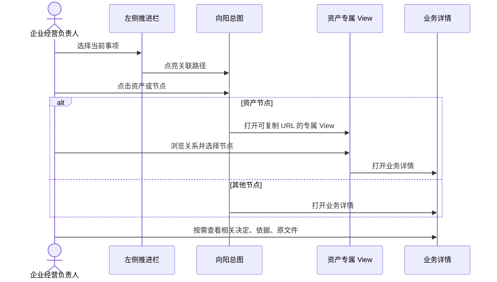

# ArcheOS 决策工作台 PRD v0.1.0

## 1. 问题与目标

企业经营负责人面对分散的资产、关系、Project、Business Line、Issue、Todo、Decision 与 Evidence 时，需要在脑中重建它们的关系。第一版用图形化 View 降低这种重建成本，让用户从资产浏览与当前推进事项自然进入详情和依据。

产品目标是提高理解与判断质量，不承诺 AI 自动给出绝对正确 Decision。

## 2. 用户角色

| 角色 | 第一版能力 |
| --- | --- |
| 企业经营负责人 | 浏览总图、定位事项、打开详情、查看 mock Decision / Evidence / Source 链 |
| External Agent | 只作为 mock 建议与草案来源，不运行、不写数据 |
| ArcheOS Core | 第一版不接入；只通过 mock View Model 模拟未来读取边界 |

## 3. 信息架构

主页面不显示最后四层的内部结构；只提供业务化链接逐层进入。

## 4. 推进 ownership

规则：

- Workspace 拥有 Roadmap；
- Project 直接拥有 Milestone，不创建内部 Roadmap；
- Business Line 通过 Relationship / View 显示相关推进路径，不取得 Roadmap ownership；
- UI 中的视觉包含关系不得改变上述语义。

### 4.1 Project / Business Line 的第一版收敛规则

- 两者使用同一种分枝节点、详情组件和关系交互；“项目与事业线”只是页面分组，不创建新的 Core concept；
- 新增 mock 条目默认是 `Project + bounded`；
- `Business Line + ongoing` 只在以下任一条件成立时使用：用户明确指定；或该事项承担持续经营责任，并且无法定义可信的完成与验收条件；
- 事项持续时间长、周期性重复或包含多个 Milestone，不自动等于 `ongoing`；
- 第一版不为了覆盖视觉状态而强行添加 ongoing fixture；只有真实走查出现例外需求时才增加；
- 该规则不合并或废弃 canonical `project` / `business_line` Role。

## 5. 功能需求

### FR-1 桌面工作台 Shell

- 默认 Workspace：笃善科技；
- 主要设备：桌面电脑；
- 左侧固定推进栏，右侧为主图；
- 顶部只保留 Workspace 名称、View 名称与必要导航；
- 页面不得显示设计 rationale、架构术语或 mock 实现说明。

### FR-2 左侧推进栏

- 显示最多三项“当前重点”；
- 显示“待完成”和“已完成”分组；
- 条目至少包含名称、状态和所属 Project / Business Line；页面默认不强调 Core Role，只有 ongoing 例外需要辨识时显示“持续事业线”；
- hover / focus 时点亮总图关联路径；
- click 时打开业务详情；
- 详情可提供 AI 草案、Decision、Evidence 与 Source 链接。

### FR-3 向阳总图

- 顶部显示 Vision，底部显示价值观；
- 资产主干第一版使用：理念、财务 / 现金、系统、团队、工作流程、服务、产品、人脉、客户；
- 主干顺序表达当前 View 的依赖阅读路径，不写回唯一 hierarchy；
- Project / Business Line 共用分枝视觉；默认呈现阶段项目，Milestone / Issue / Todo 作为推进节点；
- 选择事项时，从基础资产到目标节点点亮相关路径；
- 点击资产节点进入资产专属 View；
- 点击其他节点打开业务详情侧栏或全屏详情。

### FR-4 资产专属 View 路由

- 每个详情 View 具有可复制 URL；
- 普通点击在当前窗口进入；浏览器原生修饰键点击支持新标签页；
- 返回时恢复总图焦点与缩放位置；
- 第一版不把大型图塞进模态小窗；小信息使用侧栏。

### FR-5 理念世界 v1

- Workspace：笃善科技；
- 主阅读路径自下而上：哲学 → 数学 → 物理 → 化学 → 生物 → 社会学 → 经济学 → 商业 → 技术；
- 纵向位置表达约束深度与稳定性，横向分枝表达学派、方法或应用；
- Principle、Pattern、Protocol、Policy 与 Hypothesis 使用不同视觉状态；
- “佛学”等分枝仅作为 mock UI 示例，不自动成为 canonical taxonomy；
- 点击节点显示它约束什么、被哪些 Decision / Pattern 使用，以及相关 Evidence 链接。

### FR-6 财务三表

- 资产负债表使用平衡结构图；
- 利润表使用收入到净利润的瀑布图；
- 现金流量表使用经营 / 投资 / 融资 Sankey；
- 显示三表勾稽关系：期末现金、净利润 / 留存收益、非现金与营运资本调整；
- 第一版仅使用 mock 数值，不计算真实财务指标，不作财务建议。

### FR-7 人脉关系图与人物档案

- 人脉是完整 Person graph，不以企业经营负责人为唯一中心；
- 任意人物之间都可以显示关系；
- 第一版 UI 可展示“同学、同事、合伙人”等候选关系标签，但 mock contract 必须标注为 presentation-only；
- 点击 Person 显示：基本信息、在意事项、合作可能、决策习惯、过往经历、与其他人的关系、相关 Evidence；
- 人物档案不展示隐私评分、人格定论或缺少 Evidence 的事实判断。

### FR-8 组织与治理图

- Company Object 是中心身份；
- 法定代表人是独立 Person Object，不与 Company 合并；
- 第一版可视区分：股东 / 权益主体、法定代表人、管理团队、品牌、Business Line、Project；
- 精确公司治理关系在领域概念批准前只作为 presentation candidate；
- 点击 Person 跳转人物档案，点击 Company 保持组织与治理视角。

### FR-9 详情与追溯链

- 业务详情优先显示：名称、当前状态、与当前 View 的关系、下一动作；
- 逐层链接顺序为“相关决定 → 依据片段 → 原文件”；
- 第一版使用 mock 链接和 mock 内容，不读取真实文件；
- 候选、待确认、冲突与缺失使用清楚的业务状态，不伪装成已确认事实。

## 6. 视觉语法

| 视觉 | 含义 |
| --- | --- |
| 圆形节点 | Person |
| 矩形节点 | Company / Organization / Asset View node |
| 菱形节点 | Project / Issue / Decision focus |
| 实线 | mock 中的已确认关系 |
| 虚线 | presentation candidate / 待确认关系 |
| 高亮路径 | 当前事项与资产依赖链 |

文字只用于名称、数值、状态、关系标签和动作。页面不得把本 PRD 的设计 rationale 复制给最终用户。

## 7. 主流程

策略配置、定期 Agent 调度与 skill 自进化不属于 v0.1.0，因此策略运行图不适用。

## 8. Mock View Model 要求

- mock 数据必须显式隔离，不写入 `01_inbox/`、World Model Store 或正式业务目录；
- 使用稳定 mock ID，支持图节点、侧栏、详情 URL 与追溯链之间一致引用；
- mock 类型只表达 Presentation 读取需要，不成为 Core schema；
- Project / Business Line projection 保留 `role` 与 `lifecycle`，但使用同一 UI 组件；fixture 默认值为 `project` 与 `bounded`；
- 不发起网络请求，不接 MCP / HTTP / SQLite / JSONL；
- mock 示例必须在 UI 中自然呈现，不能用大段“这是 mock”的技术说明干扰最终用户；开发模式可以在非业务位置显示环境标识。

## 9. 状态与空页面

- `confirmed`：UI 中显示为正常状态；
- `candidate`：显示为“待确认”；
- `missing`：显示为“资料待补充”；
- `completed / in_progress / planned`：用于推进事项；
- 专属 View 尚未实现时，显示简洁图形占位与“暂未形成视图”，不显示技术栈说明。

## 10. 验收标准

1. 1440×900 桌面视口可完整使用，无关键内容遮挡；
2. 左侧重点 / Issue / Todo 可以点亮总图对应路径；
3. 总图至少可进入理念、财务、人脉、组织与治理四个专属 View；
4. 每个专属 View 有可复制 URL，并可返回总图原焦点；
5. 人脉图允许非中心人物之间建立 mock 关系；
6. Person 档案覆盖基本信息、在意事项、合作可能、决策习惯、经历、关系与 Evidence；
7. 财务 View 同时呈现三表及勾稽关系；
8. Project / Business Line 的推进路径不违反本 PRD 第 4 节 ownership；
9. Project / Business Line 使用同一节点与详情组件；默认 fixture 不出现没有明确依据的 ongoing；
10. 详情可以逐层进入 mock Decision、Evidence 与 Source；
11. 页面不展示设计 rationale、Core schema、技术 ID 或治理说明；
12. 不存在 backend 请求、正式数据写入或部署配置；
13. 键盘焦点可见，并尊重 `prefers-reduced-motion`。

## 11. 风险与后续依赖

- 当前 Core 尚无供前端消费的正式 View Model contract；本版本不得反向定义 backend schema；
- 人脉与公司治理精确关系仍需领域概念治理；
- 财务真实数据、会计口径和勾稽规则需独立权威，mock UI 不提供业务结论；
- 后续接 backend 必须另建 Issue，先固定 canonical read contract 与 production-shaped fixture。
- 走查需记录是否出现用户主动要求或完成条件无法成立的 ongoing 场景；没有出现时，不以技术完整性为由扩大 Business Line 专属能力。
