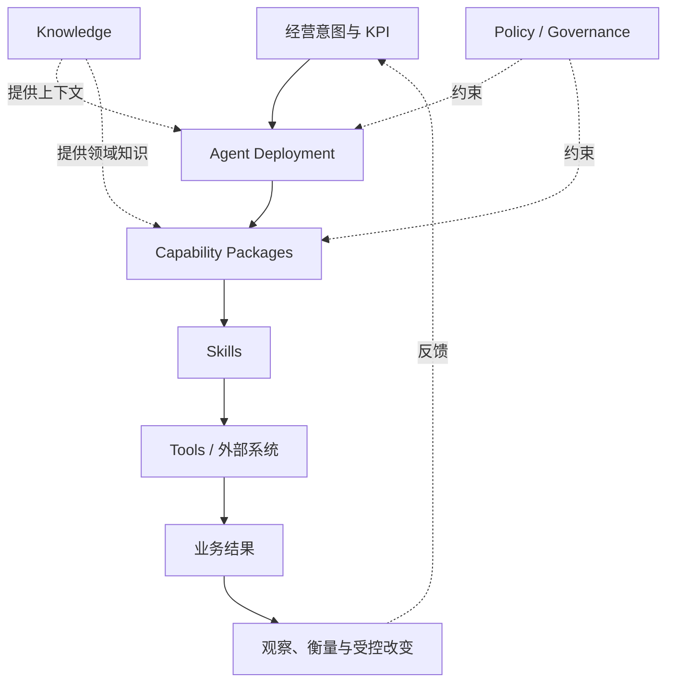
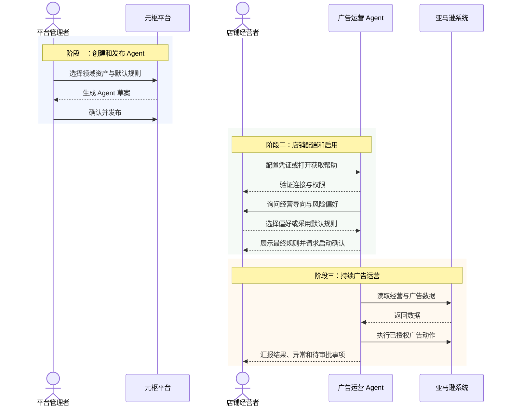
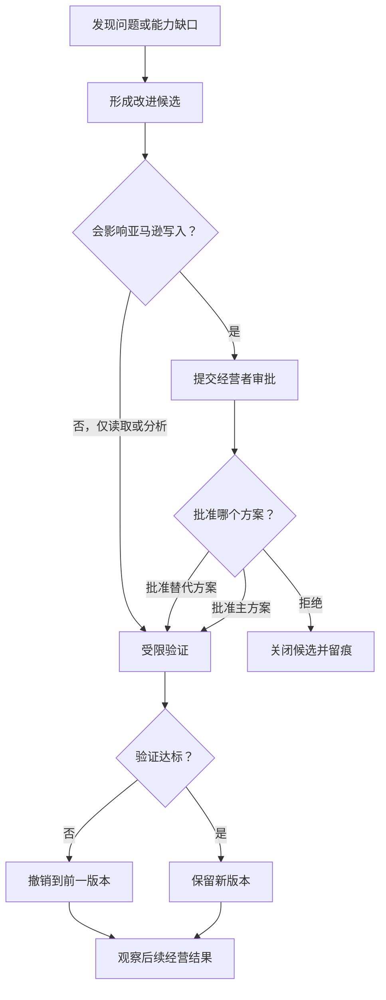

# 元枢 ArcheOS v0.1 PRD

## 1. 产品目标

为 Leo 提供一个内部平台，孵化并运行能够承担业务职责的 Agent。v0.1 以亚马逊广告运营 Agent 为首个落地实例。平台管理者负责领域知识、Capability Package、默认规则、Agent 创建与部署；店铺经营者以老板视角管理经营目标、KPI、护栏、风险偏好和店铺级限制。Agent Deployment 对被分配的 KPI 负责，通过一个或多个 Capability Package 取得业务结果，并依据真实经营反馈安全地改进自身工作方法。

## 2. 用户与角色

| 角色 | 责任 | 不负责 |
|---|---|---|
| Leo（平台管理者） | 管理领域知识与可复用能力；设置平台默认规则；智能化创建、发布和部署 Agent；处理跨 Agent 的底层问题 | 代替店铺经营者选择具体经营导向 |
| Leo（店铺经营者） | 选择经营导向与风险偏好；提供店铺凭证；设置店铺级限制；审批影响亚马逊写入方式或参数的 Agent 改变；验收业务结果 | 创建 Agent；修改平台底层能力 |
| 亚马逊广告运营 Agent | 持续获取数据、诊断、决策、执行、复盘，并提出或完成被授权的自我改进 | 绕过经营目标、权限或审批要求 |
| 元枢平台 | 创建、配置、部署、观察和治理 Agent；保留运营与变更证据 | 代替 Leo 决定最终经营方向 |
| 亚马逊及广告系统 | 提供业务数据并接收广告操作 | 定义元枢的经营目标和治理边界 |

v0.1 非目标用户包括外部付费客户、平台代理商和公开 Agent 市场参与者。

## 3. 核心用户故事

1. 作为平台管理者，我希望通过智能化流程创建广告运营 Agent，使其具备所需领域知识、Capability Package、默认规则和部署配置。
2. 作为经营者，我希望以利润金额增长为主要目标，并通过选择题或默认规则设置利润率、订单量、营收、现金流等护栏和权衡，避免单一指标优化伤害整体经营。
3. 作为经营者，我希望 Agent 持续完成数据获取、诊断、决策、执行和复盘，而不是只生成建议。
4. 作为经营者，我希望看到 Agent 做了什么、为什么做、产生了什么结果，以及是否需要我处理异常。
5. 作为经营者，我希望 Agent 能从经营结果中发现自身不足，安全地创建或修改工作方法，并证明改变有效。
6. 作为平台管理者，我希望把同一 Agent 复制到另一个隔离容器，完成少量配置后独立运行。
7. 作为经营者，我希望在不知道如何获取店铺或广告凭证时，获得清晰、逐步且与当前配置项对应的帮助。
8. 作为同时承担两种身份的用户，我希望在同一应用中明确切换“平台管理者工作台”和“店铺经营者工作台”，且每个工作台只展示该身份需要的信息与操作。
9. 作为老板，我希望默认看到全部店铺汇总经营结果，并按店铺、站点、时间、品类、商品和 Agent 筛选，快速判断利润、订单和风险变化。
10. 作为老板，我希望看到 Agent 之间的协作与汇报关系，并从经营目标追溯到关键结果、护栏、Agent 贡献和必要证据，而不是直接面对全部技术日志。

## 4. 产品原则

- **利润金额主目标**：v0.1 以利润金额增长为主要优化目标；利润率是不可突破的约束/红线，不与利润金额并列最大化。订单量、营收和现金流作为护栏与权衡项，防止通过牺牲规模或现金安全制造表面利润。
- **默认安全**：缺少关键数据、授权或证据时，默认不执行可能扩大损失的动作。
- **简单启用**：默认路径无需阅读技术文档即可完成 Agent 创建与启动。
- **行动可解释**：所有自动动作都应能回答“做了什么、为什么、依据什么、结果怎样”。
- **进化可控制**：Agent 可以改进自身，但每次改变都必须可追踪、可验证、可撤销，并服从审批边界。
- **部署可复制**：Agent 不依赖原运行环境的临时状态或隐式配置。

## 5. 主要流程

### 5.1 创建和启动 Agent

1. 平台管理者选择亚马逊广告领域知识和已发布的 Capability Package，通过智能化流程创建 Agent。
2. 平台管理者创建亚马逊业务空间，配置平台默认运营规则和 Agent 默认权限。
3. 平台生成可配置的广告运营 Agent，并展示其职责、默认能力、默认规则和可用部署方式。
4. 平台管理者确认后发布 Agent；领域资产或必要能力检查失败时不得进入可用状态。

### 5.2 经营偏好引导与启用

1. 店铺经营者选择已发布的 Agent，并配置自己的店铺凭证、广告访问凭证和大模型 API Key；每项凭证均提供逐步帮助、验证方法和常见错误提示。
2. Agent 与店铺经营者互动，通过一组选择题确认利润金额目标、利润率红线、订单量/营收/现金流护栏、风险偏好和限制规则。
3. 引导至少覆盖：利润金额目标与时间窗口、最低利润率、订单/营收不可接受下降范围、现金流安全线、风险偏好、预算与写入限制，以及必须人工确认的事项。
4. 经营者可以跳过全部引导，直接采用平台管理者发布的默认规则。
5. 经营者提出调整时，Agent 只修改该店铺的经营策略与参数，不直接修改平台底层通用能力。
6. Agent 展示最终生效的经营导向、规则来源、参数和审批边界；连接与权限验证通过后，由经营者确认启动。

### 5.3 日常广告运营闭环

1. Agent 按计划获取广告、销售、成本及必要的经营数据。
2. Agent 判断数据是否完整和新鲜，并识别异常或优化机会。
3. Agent 根据经营者选择的导向、优先级、参数组合、预算和风险边界生成动作。
4. 低风险且已授权的动作自动执行；高风险或超出授权的动作等待店铺经营者审批。
5. Agent 记录动作、依据、执行结果和后续观察窗口。
6. Agent 在观察窗口结束后复盘业务影响，继续、调整、撤销或升级给店铺经营者。

### 5.4 Agent 持续进化闭环

1. Agent 根据重复失败、经营结果偏差或人工反馈识别能力缺口。
2. Agent 形成明确的改进假设、目标、风险和验证标准。
3. 如果改变可能影响亚马逊写入的方法、写入参数或写入范围，必须先提交店铺经营者审批；纯读取和分析方法的改变可以自动进入受限验证，但必须在管理界面留痕。
4. 改变先在受限范围验证，不得直接无边界扩大影响。
5. 达标则保留并形成新版本；不达标或触发安全线则撤销。
6. 平台保留改变前后内容、证据、审批、结果和撤销信息。

### 5.5 独立容器部署

1. 平台管理者选择一个已发布的 Agent 创建新部署。
2. 平台生成明确的必要配置清单，不复制原环境中的密钥或临时状态。
3. 平台管理者在另一个隔离容器填写密钥引用、店铺凭证、广告访问凭证和授权配置。
4. 新容器完成连接与权限自检后独立启动。
5. 原容器停止或不可访问时，新容器仍能完成规定的运营周期。

## 6. 产品全景图

**图的意图：**用一条主路径展示元枢如何从领域资产出发，完成 Agent 创建、店铺启用、广告运营、受控进化与独立部署。

**读图方式：**实线是业务责任主链：经营意图和 KPI 先分配给 Agent Deployment，Agent 使用 Capability Package 取得结果，Skill 负责具体方法，Tool 与外部系统完成底层操作。Knowledge、Policy 和 Governance 横向支撑，Observation、Measure 与 Change 形成反馈链。

| 阶段 | 主要责任人 | 产品结果 |
|---|---|---|
| 领域资产 | 平台管理者 | 可用于创建 Agent 的 Knowledge、Capability Package 和默认规则 |
| Agent 创建 | 平台管理者 | 已发布、可配置的广告运营 Agent |
| 店铺启用 | 店铺经营者 | 已验证凭证、经营导向和审批边界 |
| 广告运营 | Agent | 有证据的分析、决策、执行和复盘 |
| 受控改进 | Agent + 对应审批人 | 可验证、可撤销的新版本 |
| 独立部署 | 平台管理者 | 不依赖原容器临时状态的新部署 |

## 7. 双角色主流程

**图的意图：**明确平台管理者与店铺经营者不是同一产品权限，创建 Agent 与使用 Agent 是两个连续阶段。

**边界：**店铺经营者不能创建或发布 Agent；平台管理者不能替店铺经营者选择具体经营导向。两种身份在 v0.1 都由 Leo 承担，但权限必须分开建模和展示。

## 8. Agent 受控进化决策图

**图的意图：**把读取/分析改变与可能影响亚马逊写入的改变分流，避免“自动进化”被误解为 Agent 可以任意改写自身。

**读图方式：**所有改变都必须留痕、验证并可撤销；区别只在于是否需要事前人工审批。涉及写入方法、参数或范围的改变必须审批，纯读取和分析改变可以自动进入受限验证。

## 9. 功能需求

### FR-1 Agent 创建与配置

- 只有平台管理者可以创建、发布和部署 Agent；店铺经营者只能选择和使用已发布 Agent。
- 平台必须支持根据亚马逊广告领域知识与已发布的 Capability Package，智能化创建一个承担广告运营职责的 Agent。
- 必须明确显示 Agent 的经营目标、职责范围、连接状态、自动执行权限、审批边界和运行状态。
- 缺少必填配置时不得启动自动运营。
- 平台必须提供 Knowledge、Capability Package、Skill、Policy 等领域资产及其状态、版本、适用范围和验证证据的管理入口。

### FR-2 经营目标与安全边界

- 平台管理者必须能够发布平台默认运营规则。
- 店铺经营者必须能够通过选择题设置利润金额目标、利润率红线、订单量/营收/现金流护栏、风险偏好、广告预算边界和店铺级限制。
- 店铺经营者可以跳过引导并直接采用默认规则，且可以在启用前查看最终生效配置。
- 不同护栏强度与权衡偏好必须能够产生不同的策略组合与参数配置；产品层只规定结果，不指定底层调用方式。
- 规则发生冲突时采用更保守的限制，并向对应的店铺经营者显示冲突。
- Agent 不得自行放宽由店铺经营者或平台管理者设置的更高层级限制。

### FR-3 广告自动运营

- Agent 必须按计划完成数据获取、完整性检查、诊断、决策、执行和复盘。
- 每个动作必须关联输入数据、判断理由、授权依据、执行结果和复盘时间。
- 数据缺失、过期、连接失败或权限不足时，Agent 必须降级为不执行并告警。

### FR-4 审批与人工接管

- 任何可能改变亚马逊写入方法、写入参数或写入范围的 Agent 自我改变，必须进入人工审批状态，并展示改变内容、影响、验证方案和可选替代方案。
- 纯读取或分析方法的改变可以不经审批，但必须在管理界面留痕并允许查看改变前后内容与验证结果。
- 高风险、越权或证据不足的运营动作必须进入待审批状态。
- 店铺经营者可以批准或拒绝店铺级待审批事项，并可暂停 Agent 或立即停止自动执行；平台管理者可以在平台级暂停或停用 Agent 版本。
- Agent 暂停后不得继续产生新的外部写操作。

### FR-5 结果观察与汇报

- 平台必须展示 Agent 当前状态、最近动作、经营影响、异常、待审批事项和改变历史。
- 每个运营周期必须形成简明结果摘要，并允许追溯到详细证据。
- 必须区分已核实结果、推断和因数据缺失无法判断的事项。

### FR-6 Agent 自我改进

- Agent 必须能从失败、经营偏差和人工反馈中形成改进候选。
- 每个候选必须包含问题、改进假设、目标、风险、验证标准和撤销条件。
- 被授权的非关键改变可自动进入受限验证；关键改变必须经对应的店铺经营者或平台管理者审批。
- 改变必须版本化，验证失败或触发安全线时能够恢复到前一可用版本。
- 禁止 Agent 未经治理直接修改经营目标、最高级限制、密钥或审批规则。

### FR-7 独立部署

- 平台必须支持把同一 Agent 部署到另一个隔离容器。
- 新部署只通过显式配置获得密钥引用、店铺凭证、广告访问凭证、经营目标和授权范围。
- 新部署不得依赖原容器的内存、未声明文件、密钥或持续网络连接。
- 部署必须提供自动自检，并明确报告可运行、降级或阻塞状态。

### FR-8 凭证配置帮助

- 店铺凭证、广告访问凭证和大模型 API Key 必须分开配置和验证。
- 每个配置项必须提供对应的获取步骤、所需权限、验证方法、安全提示和常见错误处理。
- 帮助信息不得展示、记录或回传用户的真实密钥。
- 用户可以在不离开当前配置流程的情况下打开帮助，并在完成后继续原步骤。

### FR-9 平台管理与领域资产

- 平台管理者必须能够查看亚马逊广告领域所需 Knowledge、Capability Package、Skill、默认规则及其状态。
- 必须能够识别某项能力是可用、受限、待验证、已停用还是存在问题，并查看版本和验证证据。
- Agent 创建流程必须只选择状态满足发布条件的领域资产。
- 店铺经营者提出的偏好修改只改变店铺级策略和参数，不得直接改写平台通用的数据获取等底层能力。

### FR-10 同一应用中的双工作台

- MVP 复用现有 `apps/business-cockpit/`，在同一应用中提供“店铺经营者”和“平台管理者”两个明确工作台。
- 身份切换必须持续可见，并明确显示当前身份、当前业务空间和当前权限范围。
- 店铺经营者工作台包含：经营驾驶舱、经营目标与护栏、Agent、凭证与帮助、经营分析、收件箱、经营动态/决策记录。
- 平台管理者工作台包含：平台总览、Agent 工厂、Capability Package、Knowledge 与其他亚马逊领域资产、默认规则、Agent 版本与进化、部署与运行实例、跨 Agent 问题和平台审计。
- 同一底层信息可以被两个工作台引用，但菜单、默认首页和允许操作必须按身份分离，不得仅靠隐藏按钮模拟权限。
- v0.1 两种身份均由 Leo 承担，但产品模型必须允许未来由不同用户分别承担。

### FR-11 领域资产的用户可见生命周期

- 平台管理者必须能看到每项领域资产的状态、版本、来源、验证结果、依赖、适用范围和最近改变。
- v0.1 的用户可见状态统一为：`草稿 → 验证中 → 可发布 → 已发布 → 已暂停 → 已废弃`。
- 只有平台管理者可以提交验证、发布、暂停、恢复或废弃资产；Agent 和店铺经营者不能自行转换平台资产状态。
- 资产进入“可发布”前，至少必须具备固定版本与摘要、来源、职责和边界、权限需求、验证结果、失败影响、分发范围及可用撤销目标。
- 已暂停或已废弃资产不得进入新的 Agent 发布；使用相关资产的现有 Agent 必须显示影响和处理建议。

### FR-12 Agent Factory 最终产物与发布确认

- Agent Factory 的最终可见产物是一个待发布的 Agent Profile 候选及验证报告，而不是已运行 Agent。
- 发布确认页必须展示：业务职责、KPI 责任、适用领域、精确 Capability Package 与其他资产版本清单、默认规则、Skill/Tool 与数据权限、审批边界、凭证需求、Schedule、目标 Runtime、部署计划、已知限制、验证结果和撤销目标。
- 平台管理者必须明确确认 Agent 名称与职责、资产与版本、权限和审批边界、部署目标及发布版本后，候选才可发布。
- 任一必要资产不可发布、摘要变化、权限不满足或验证失败时，发布必须阻塞并给出可操作原因。

### FR-13 异常通知、确认、升级与恢复闭环

- v0.1 必须通知：写入被安全机制阻止、数据缺失或过期、凭证或权限失效、Amazon/Ops Kit/模型服务不可用、重复执行风险、计划任务连续失败、Agent 或资产版本回滚。
- 店铺级经营和写入异常通知店铺经营者；平台级资产、部署、Runtime 和跨 Agent 异常通知平台管理者；同时影响两者时双方都进入待办队列。
- MVP 至少提供应用内持久通知和待办队列；外部消息渠道不作为 v0.1 验收前提。
- 每项异常必须具有：首次发生时间、影响范围、当前降级状态、证据引用、责任角色、确认状态、升级状态、建议操作和恢复检查结果。
- 异常只有在原因已解除、必要连接与权限重新验证、积压动作已处理，并由对应责任人确认恢复后才能关闭；涉及写入恢复时必须由店铺经营者明确恢复自动执行。

### FR-14 数据与证据保留、导出和恢复

- v0.1 的运营输入快照、决策理由、动作、审批、执行响应、异常、复盘和 Change 证据必须保存在部署外的持久存储中，容器重建不得导致证据丢失。
- 运营与运行证据默认至少保留 90 天；Agent/资产版本、审批、发布、撤销和高风险写入证据在 v0.1 期间持续保留，除非平台管理者明确导出后删除。
- 平台管理者可以按 Workspace、Agent、时间和事件类型导出机器可读证据包；导出包必须包含清单、版本、摘要和关联引用，不得包含秘密值。
- 恢复功能必须能从受验证的导出包重建证据索引和关联关系；不可变历史不得因恢复而被覆盖或改写。
- 删除和清理必须记录操作者、范围、理由与结果；店铺经营者不能删除平台级审计证据。

### FR-15 控制面故障时的人工接管

- 当控制面、授权、写入协调、凭证解析或关键证据持久化不可用时，系统必须停止新的 Amazon 写入，不得沿用无法验证的旧授权。
- 在数据仍可信且凭证可用时，读取、分析和本地结果导出可以降级继续，并清楚标记“只读降级”。
- 店铺经营者必须拥有不依赖正常控制面页面的紧急停止入口，用于停止当前 Workspace 的 Agent 和外部写入。
- 平台管理者必须能查看故障范围、受影响 Deployment、最后安全状态和恢复检查清单，并可在服务恢复后执行重新验证。
- 写入恢复必须满足关键服务可用、积压意图已清理、写入者状态唯一、证据存储可用，并由店铺经营者明确恢复；不得自动补执行故障期间积压的写入动作。

### FR-16 Amazon Ops Kit 的产品可见边界

- v0.1 对店铺经营者呈现一个统一的“元枢亚马逊广告 Agent”产品体验，不要求经营者学习、安装或操作第二套 Ops Kit 产品界面。
- Amazon Ops Kit 作为元枢内部的 Amazon 广告执行内核和领域资产来源，不拥有经营目标、用户权限、审批、Agent 生命周期或最终产品状态。
- 平台管理者可以在领域资产和部署详情中看到 Ops Kit 来源、版本、摘要、健康状态、兼容性和错误证据，但不通过独立 Ops Kit 工作流创建或治理 Agent。
- Ops Kit 不可用或版本不兼容时，元枢必须把相关能力和 Agent 标记为受限或阻塞，并通过统一异常闭环处理。

### FR-17 Capability Package 产品语义

- Capability Package 是 ArcheOS 一级、版本化、可发布的业务职责资产，定义“可以独立承诺、独立调用、独立验收的最小业务价值单元”。
- 一个 Capability Package 必须能被业务用户理解为明确结果，例如“诊断广告浪费并形成可执行调整方案”；不得只以模型、API、脚本、页面或内部步骤命名。
- 最小结果契约必须包含：业务结果、适用对象与范围、输入、输出、前置条件、KPI/Measure、成功阈值、证据要求、权限与审批、失败/降级语义、依赖的 Skill/Tool/Knowledge/Policy、兼容版本和责任人。
- Capability Package 可以由一个或多个 Skill 实现；Skill 是可替换执行方法，不拥有业务结果承诺。Tool/External System 只提供底层操作，不拥有业务责任。
- Capability Package 使用统一领域资产生命周期，并且可以独立验证、发布、暂停、废弃、回滚和分发。不同实现 Skill 不得在未变更 Package 版本或兼容声明的情况下改变其业务结果语义。
- Agent Deployment 可以组合多个已发布 Capability Package，但必须清楚显示每个 Package 对哪些 KPI 或中间结果负责，以及缺失或失效时对 Agent 的影响。
- 产品语义中删除 Capability View；平台直接展示真实 Capability Package 及其版本、状态、依赖和验证证据，不再把“派生能力视图”作为产品概念。

### FR-18 KPI 与业务责任链

- 产品责任链确认为：`Business Intent / KPI → Agent Deployment → Capability Package → Skill → Tool / External System → Business Result`。
- 店铺经营者设置 Business Intent 和目标 KPI；Agent Deployment 对被分配的 KPI 结果负责，并展示当前值、目标值、时间窗口、证据状态和偏差。
- Capability Package 对自身结果契约及其 Measure 负责；它可以贡献 Agent KPI，但不得把相关性或局部指标冒充最终 KPI 达成。
- Skill 对执行正确性、输入输出和方法级质量负责；Tool/External System 对调用结果和外部事实负责。
- 业务结果必须经 Observation 和 Measure 形成证据，再判断 Capability 和 Agent 是否达标；失败可形成 Change，但不得回写或篡改历史 Observation。
- Agent 创建、发布和复盘页面必须能从 Agent KPI 追溯到相关 Capability Package、执行 Skill、Tool 调用和业务证据。

### FR-19 Knowledge 分类、分发与提升

- Knowledge 至少分为四类，每条知识必须声明类别、所有者、作用域、来源、版本、权限、分发规则和状态：

| Knowledge 类别 | 产品归属与用途 | 分发与权限 | 版本与提升边界 |
|---|---|---|---|
| 系统核心知识 | ArcheOS 平台级；解释产品原则、对象规则、安全底线和默认行为 | 随平台发布，只读分发给兼容环境；仅平台管理者可批准变更 | 跟随平台版本；不得被企业私有覆盖或由运行反馈自动修改 |
| 可分发领域知识 | 领域级；支持 Amazon Ads 等 Capability Package 和 Agent | 经平台管理者发布后按领域、Package 和兼容范围分发；店铺经营者只读使用 | 独立版本化和验证；可由脱敏候选提升，但必须人工评审、去客户化并通过发布门禁 |
| 企业私有知识 | Workspace/企业所有；表达店铺事实、偏好、案例和私有方法 | 默认只在所属 Workspace 内可见和使用，不得进入公共包或跨企业分发 | 可版本化和撤销；提升为领域知识必须获得所有者授权并完成脱敏、抽象、验证和重新发布 |
| 运行证据 / 学习候选 | 运行环境与 Workspace 产生；记录 Observation、反馈、失败和候选经验 | 仅授权角色按证据权限访问；默认不作为 Agent 的正式知识直接分发 | 不可把证据自动提升为规则或知识；经筛选后只能生成候选，进入对应知识类型的评审流程 |

- Knowledge 的用户可见状态至少为：`草稿 → 评审中 → 已批准 → 已发布 → 已暂停 → 已废弃`；运行证据/学习候选使用 `已记录 → 待筛选 → 已拒绝 / 已提升候选`，不与正式知识混用。
- Capability Package 和 Agent 必须引用固定 Knowledge 版本或兼容范围；知识摘要变化时应触发影响检查，不能静默改变已发布 Agent 的行为。
- Tolaria 明确为可替换的 Markdown 知识管理载体和适配来源，不是 ArcheOS 产品模块、运行时依赖或核心对象。ArcheOS 应能通过标准 Markdown 与元数据导入、导出或替换载体，且在 Tolaria 不可用时继续运行已发布的版本化知识。

### FR-20 老板视角经营驾驶舱

- 店铺经营者工作台默认首页必须以老板视角显示全部已授权店铺的汇总结果，而不是默认锁定单一店铺或技术运行状态。
- 首屏核心指标至少包括：营业额、利润金额、利润率、订单量，并显示当前值、同比/环比或上一可比周期变化、方向和异常提示。
- 驾驶舱必须支持按店铺、站点、时间、品类、商品和 Agent 筛选；筛选条件必须持续可见，指标、关键结果、Agent 贡献和待办摘要同步更新。
- 多币种汇总必须展示统一口径、换算时间和原币查看入口；数据不完整、时间窗口不一致或只能估算时必须明确标记，不能伪装成精确汇总。
- 首屏优先回答“整体经营结果如何、为何变化、哪里需要关注、谁在负责”，技术运行细节只在按需下钻时出现。

### FR-21 目标、关键结果与证据的三层结构

- “经营分析”继续采用三层信息层级，并在第二、三层提供经营目标推进树：
  1. **经营目标 / OKR**：利润金额主目标、责任人、周期和当前判断；
  2. **关键结果与护栏 + 推进树摘要**：利润金额进度、利润率红线、订单量/营收/现金流护栏、阶段成果及偏差；
  3. **经营策略、动作、指标、Agent 贡献与证据**：当前推进事项、趋势、归因假设、Agent 动作与贡献、必要业务证据。
- 老板默认只看到第一、二层和第三层摘要；原始 Observation、Tool 调用、digest、trace、技术日志等只在“查看详细证据”后按需展示。
- Agent 贡献必须区分已核实贡献、合理推断和无法判断，不得把相关性直接表述为因果或已创造利润。
- 任何目标或关键结果都必须能追溯到负责的 Agent、相关 Capability Package、Measure 和业务证据，但下钻层级不能阻塞老板完成日常判断。

### FR-22 Agent 组织与汇报关系

- 店铺经营者一级目录统一命名为“Agent”，不限定广告 Agent；v0.1 仍只交付 Amazon Ads Agent 的真实运营能力。
- Agent 页面必须展示每个 Agent 的业务职责、负责 KPI、状态、当前优先事项、上级汇报对象、协作 Agent 和最近汇报。
- 汇报关系至少支持：`向老板直接汇报`、`向另一个 Agent 汇报`、`与其他 Agent 协作但不改变 KPI 责任`。
- 每个 Agent 必须只有一个主要 KPI 责任归属和一个主要汇报对象；协作关系不得模糊最终责任。
- 汇报内容面向经营结果：本期结果、偏差、原因、动作、风险、需要老板决定的事项；不以 Runtime 状态或技术日志代替汇报。

### FR-23 收件箱、经营动态与安全入口

- 店铺经营者一级目录使用“收件箱”，统一承载待审批、异常、需确认、恢复、信息通知；按紧急程度、类型、Agent、Workspace 和状态筛选。
- 经营驾驶舱只显示高优先事项摘要与快捷入口，不重复建设完整审批或异常页面。
- “店铺级改变记录”改为“经营动态/决策记录”，用于按时间展示经营目标调整、老板决策、Agent 重要动作、结果变化、异常与恢复；默认使用业务语言，并允许下钻到 Change/证据。
- “紧急停止与恢复”不作为常用一级目录；入口放在 Agent 运行状态与安全控制中。出现高风险、写入异常或控制面故障时，驾驶舱和收件箱必须出现显眼快捷入口。
- 收件箱项目处理后必须保留到经营动态/决策记录，不因完成而丢失责任、理由和结果。

### FR-24 经营目标推进树

- 产品采用纵向经营目标推进树：`经营目标 → 阶段成果 → 经营策略 → 经营动作`。
- 正式术语固定为：
  - **经营目标（Business Goal）**：承载 Business Intent、目标 KPI、周期、老板责任和护栏；
  - **阶段成果（Goal Checkpoint）**：目标周期内可独立判定是否取得的中间业务结果，不使用开发 Milestone；
  - **经营策略（Operating Strategy）**：为取得阶段成果而验证的策略假设或推进事项，不使用开发 Issue；
  - **经营动作（Operating Action）**：由人或 Agent 计划并执行的具体业务动作。
- 推进树本身是根据四层正式关系生成的用户视图，不作为新的一级对象。经营目标沿用 Business Intent/KPI；阶段成果和经营策略必须有正式、持久化、可审计的产品契约；经营动作必须有持久化计划/执行记录。Architecture 决定它们作为核心对象、聚合内实体或契约记录的技术归属。

| 层级 | 必要字段 | 状态 | 完成判定 |
|---|---|---|---|
| 经营目标 | goal_id、Workspace、标题、目标 KPI/值、周期、负责人、护栏、当前值、偏差、证据时间 | 草稿 / 进行中 / 有风险 / 已达成 / 已暂停 / 已关闭 | KPI 在规定周期达到目标且红线/护栏未被违反，并由负责人确认；不能只因下级事项完成而达成 |
| 阶段成果 | checkpoint_id、goal_ref、预期业务结果、目标日期、负责人、Measure/阈值、依赖、偏差、证据 | 计划中 / 进行中 / 有风险 / 已取得 / 未取得 / 已取消 | 预期结果和阈值由业务证据证明；动作完成但结果未达标时不得标记已取得 |
| 经营策略 | strategy_id、checkpoint_ref、标题、策略假设、预设目标、适用范围、负责人、状态、护栏、预期结果、实际结果、复盘窗口、结论、负责/协作 Agent、验收条件、证据 | 草案 / 待审批 / 已批准 / 进行中 / 已阻塞 / 复盘中 / 已完成 / 已拒绝 / 已取消 | 预设目标与验收条件达成、实际结果及护栏有证据且已形成复盘结论；仅完成所有动作不构成策略完成 |
| 经营动作 | action_id、strategy_ref、执行者、动作类型、目标对象、计划时间、授权/审批、执行状态、结果、证据引用 | 计划中 / 待审批 / 已授权 / 执行中 / 已成功 / 已失败 / 已取消 / 已回滚 | 动作获得所需授权并有执行结果/readback 证据；动作成功不等于策略或目标达成 |

- 关联关系固定为：一个经营目标包含一个或多个阶段成果；阶段成果可以依赖其他阶段成果；每个经营策略主要归属一个阶段成果，可引用其他目标影响；每个经营动作主要归属一个经营策略。
- 树节点必须显示目标达成汇总、偏差、负责人、周期、负责 Agent、状态和证据新鲜度。目标/阶段成果显示业务结果进度；策略显示预设目标及假设验证进度；动作显示执行进度，三者不得混为同一百分比。
- 利润金额主目标、利润率红线、订单量/营收/现金流护栏始终显示在目标和相关阶段成果上；推进树不得替代 KPI、Measure、护栏或经营结果汇总。
- 默认树只展示老板理解所需的标题、状态、偏差、负责人、周期和关键证据摘要；技术 trace、Tool 调用和 digest 按需下钻。

#### 经营策略详情抽屉

点击经营策略必须打开详情抽屉，至少显示：策略假设、预设目标、适用范围、负责人、状态、护栏、预期结果、实际结果、复盘窗口与结论、负责与协作 Agent、经营动作列表、证据摘要、验收条件、完成判定、阻塞原因、关联收件箱事项和经营动态记录。

抽屉允许老板查看、批准/拒绝需要老板决定的策略草案、调整优先级或打开关联动作；不允许在无审批边界时直接触发 Amazon 写入，也不展示开发 Issue、PR、commit 等协作术语作为老板主界面。

### FR-25 上下文对话、草案变更与权限边界

- 经营结果页面右侧提供 Agent 对话框，并持续绑定当前经营目标、阶段成果、经营策略或经营动作节点；切换节点时必须明确显示上下文变化。
- Agent 回复分类固定为：解释、建议、草案变更、待审批动作、已执行结果。对话本身不构成授权，普通自然语言不得被解释为无限授权。
- 草案变更必须先展示目标对象、字段 diff、理由、预期影响、相关护栏、证据和审批要求；只有通过适用的 Change、Policy 与审批边界后才可正式生效。
- Agent 可依据用户意图创建或调整经营计划、阶段成果、经营策略、经营动作的草案，并更新进度、预测、风险和复盘候选；不得借此修改系统代码或平台正式资产。
- 对话及其草案、审批和执行结果必须进入审计/经营动态，并保留当前节点关联。

| 权限类别 | Agent 产品权限 |
|---|---|
| 可读 | 授权 Workspace 内的经营目标、阶段成果、经营策略、经营动作、经营数据、Policy、Knowledge、Measure、Observation 和历史复盘 |
| 可创建/调整草案 | 经营计划、阶段成果、经营策略、经营动作、进度、预测、风险和复盘候选；正式生效仍服从审批边界 |
| 可自动执行 | 仅限已授权、低风险且满足 Policy/护栏的经营动作；必须记录输入、理由、授权依据、结果和复盘窗口 |
| 必须审批 | 最高级经营目标或红线护栏；扩大外部写入、预算或自动化权限；高风险策略；恢复写入；跨 Workspace 请求；以及被规则标记为需批准的草案正式生效 |
| 严格禁止 | 修改 ArcheOS、Runtime、Skill、Tool、Adapter 或 Ops Kit 源代码；修改平台正式 Capability Package、Policy 或 Knowledge；读取明文 Secret；跨 Workspace 读取或操作；篡改证据、审批、审计或历史；绕过 Change、发布或审批；把对话视为无限授权 |

## 10. 状态模型

### Agent 运行状态

`待配置 → 待验证 → 可启动 → 运行中 → 已暂停 → 已停止`

- 任一关键连接或权限失效时，运行中 Agent 进入降级或暂停状态。
- 只有通过配置与连接检查的 Agent 才能进入运行中。

### 运营动作状态

`候选 → 待审批 / 已授权 → 执行中 → 已执行 → 观察中 → 保留 / 撤销 / 失败`

### Agent 改变状态

`候选 → 风险判断 → 待审批 / 已授权 → 受限验证 → 保留 / 撤销 / 失败`

### 领域资产状态

`草稿 → 验证中 → 可发布 → 已发布 → 已暂停 → 已废弃`

### 异常状态

`新发生 → 待确认 → 处理中 / 已升级 → 待恢复验证 → 已关闭`

### Capability Package 状态

`草稿 → 验证中 → 可发布 → 已发布 → 已暂停 → 已废弃`

### 正式 Knowledge 状态

`草稿 → 评审中 → 已批准 → 已发布 → 已暂停 → 已废弃`

### 运行证据 / 学习候选状态

`已记录 → 待筛选 → 已拒绝 / 已提升候选`

### 经营目标推进状态

- 经营目标：`草稿 → 进行中 / 有风险 → 已达成 / 已暂停 / 已关闭`
- 阶段成果：`计划中 → 进行中 / 有风险 → 已取得 / 未取得 / 已取消`
- 经营策略：`待评估 → 已批准 → 进行中 / 已阻塞 / 验证中 → 已完成 / 已拒绝 / 已取消`
- 经营动作：`计划中 → 待审批 / 已授权 → 执行中 → 已成功 / 已失败 / 已取消 / 已回滚`

## 11. 数据与集成要求

- 亚马逊广告数据：广告活动、广告组、关键词或投放对象、搜索词、花费、销售归因及执行结果。
- 经营数据：订单与销售、商品成本、平台费用、退款及其他计算利润所需的数据。
- 配置数据：店铺凭证引用、广告访问凭证引用、大模型 API Key 引用、经营导向、优先级、风险偏好、参数组合、预算边界、授权和审批规则。
- 运行证据：数据获取时间、输入快照、决策理由、动作、审批、执行响应、错误和复盘结果。
- 改变证据：改变前后版本、问题与假设、验证范围、结果、批准人和撤销信息。
- Capability Package 数据：结果契约、KPI/Measure、依赖、权限、兼容性、版本、状态、发布与验收证据。
- Knowledge 数据：类别、所有者、作用域、来源、版本、权限、分发规则、状态和提升记录。
- 密钥不得进入普通日志、结果摘要或可复制的 Agent 包。

## 12. 经营目标、护栏与指标口径

v0.1 的目标模型固定为一个主要优化目标加多项护栏，不把所有指标并列最大化：

| 层级 | 指标 | 产品语义 |
|---|---|---|
| 主要目标 | 利润金额 | 在约束允许范围内优先提高总利润金额；按经营者选择的周期衡量 |
| 核心红线 | 利润率 | 最低可接受利润率；用于阻止以低质量收入换取利润金额，不作为并列最大化目标 |
| 规模护栏 | 订单量、营业额 | 限制不可接受的订单或营收下降，防止通过缩减业务制造更高利润率 |
| 安全护栏 | 现金流 | 约束资金占用和现金风险；触线时可以压制增长或广告扩张动作 |
| 运营护栏 | 预算、库存健康、数据新鲜度、风险权限 | 限定执行空间和自动化边界 |

当目标和护栏冲突时：硬红线优先于利润金额优化；同级护栏采用更保守限制并提示老板；系统必须说明牺牲了什么、保护了什么，以及需要老板决定的权衡。

利润相关判断使用贡献利润口径：

`贡献利润 = 销售收入 - 商品成本 - 平台费用 - 广告花费 - 退款及其他可归属变动成本`

- 优先使用店铺经营者配置或确认的真实成本。
- 缺少真实成本时允许使用明确标记的估算成本，但必须显示来源和置信度。
- 估算利润与真实成本利润必须明确区分。
- 缺少精确成本不应阻止只读诊断，但应阻止无法证明安全的利润敏感型自动动作。

## 13. v0.1 验收标准

### AC-1 Agent 孵化

- 从空白业务空间开始，平台管理者能从已治理的亚马逊广告领域资产创建并发布一个可运行的广告运营 Agent。
- Agent 的职责、目标、权限、审批边界和当前状态清晰可见。
- 店铺经营者不能创建 Agent，但可以选择已发布 Agent 并完成店铺启用。

### AC-1A 引导与凭证帮助

- 店铺经营者可以完成经营导向、风险偏好和限制规则的选择题引导，也可以跳过并采用平台默认规则。
- 至少验证默认、利润率红线更严格、订单量护栏更严格三种配置会产生可见的不同参数、策略组合或阻塞结果。
- 店铺凭证与广告访问凭证均提供逐步获取帮助、验证和常见错误提示。

### AC-2 广告运营闭环

- Agent 在连续运营周期中完成数据获取、诊断、动作决策、授权范围内执行和结果复盘。
- 至少存在一个真实广告动作从候选走到执行和复盘，并保留完整证据。
- 缺失数据或越权场景能够被阻止，且不会产生未经授权的广告写操作。

### AC-3 可控进化

- Agent 基于真实运营反馈形成至少一个工作方法改进候选。
- 至少一个改变完成“提出 → 风险判断 → 受限验证 → 保留或撤销”的完整闭环。
- 能演示影响亚马逊写入方法或参数的改变等待人工审批，并展示一个替代方案。
- 能演示纯读取/分析改变无需审批但完整留痕，以及验证失败后恢复前一版本。

### AC-4 独立容器部署

- 同一 Agent 成功部署到第二个隔离容器。
- 第二容器在显式配置后通过自检，并能在原容器不可用时独立完成至少一个运营周期。
- 两个容器的密钥、运行状态和日志互不依赖、不相互泄漏。
- 第二容器可以获得与第一容器相同的亚马逊写入范围；系统必须防止两个容器对同一对象和同一运营周期重复执行。

### AC-5 经营与安全

- 所有自动广告动作都能追溯到经营目标、数据证据和授权边界。
- 任何触发预算红线、权限不足或关键数据缺失的动作均被阻止或转为审批。
- 全程不存在未经授权的高风险写操作。

### AC-6 双工作台

- 用户可以在同一应用中切换平台管理者和店铺经营者工作台，并始终看见当前身份。
- 两个工作台拥有不同导航、默认首页和可操作范围。
- 店铺经营者无法进入 Agent 创建、平台默认规则发布和跨 Agent 版本管理操作。
- 平台管理者不会在默认流程中替店铺经营者选择店铺经营导向或提交店铺凭证。
- Leo 能以两种身份分别完成一次端到端原型走查，且无需依赖开发者解释页面权限。

### AC-7 领域资产生命周期

- 平台管理者能演示一项 Amazon 领域资产从草稿、验证、发布到暂停或废弃的完整状态变化。
- 未满足最小发布证据的资产不能进入“可发布”，暂停或废弃资产不能进入新的 Agent 发布。
- 已发布资产被暂停时，平台能列出受影响 Agent 并给出继续受限运行、替换或暂停建议。

### AC-8 Agent Factory 发布确认

- Agent Factory 能生成一个包含 FR-12 全部确认项的 Agent Profile 候选和验证报告。
- 平台管理者未明确确认资产版本、权限边界和部署计划前，系统不能发布或实例化 Agent。
- 任一输入资产摘要变化后，旧确认失效，系统重新验证并要求再次确认。

### AC-9 异常闭环

- 至少演示一次店铺级写入异常和一次平台级部署或资产异常，从通知、确认、升级、处置、重新验证到关闭形成完整记录。
- 写入异常在店铺经营者明确恢复前不得恢复自动写入。
- 应用重启后，未关闭异常和待办仍然可见。

### AC-10 数据与证据

- 容器重建后，运营、审批、异常和 Change 证据仍可查询。
- 平台管理者可以导出一个不含秘密值、包含清单与摘要的证据包，并在空白证据索引中恢复关联关系。
- 系统能证明默认 90 天运营证据保留规则以及版本、审批和高风险写入证据的持续保留规则已生效。

### AC-11 人工接管

- 模拟控制面或写入协调故障时，新 Amazon 写入被阻止，可信数据的读取和分析以只读降级继续。
- 店铺经营者可以通过紧急停止入口停止 Workspace 写入。
- 故障恢复后，系统不会自动补执行积压写入；完成恢复检查并经店铺经营者确认后才恢复。

### AC-12 Ops Kit 产品边界

- 店铺经营者可以完成 Agent 启用和运营闭环，不需要进入 Ops Kit 独立界面或运行 Ops Kit 命令。
- 平台管理者能在元枢内查看 Ops Kit 来源、版本、摘要、健康和兼容状态。
- Ops Kit 不可用或版本不兼容时，元枢统一显示受限或阻塞状态并进入异常闭环。

### AC-13 Capability Package

- 平台管理者可以创建一个满足 FR-17 最小结果契约的 Amazon Ads Capability Package，并完成独立验证、发布、暂停和回滚。
- 同一 Capability Package 更换兼容 Skill 后，业务结果契约和验收标准保持不变；不兼容变化必须产生新 Package 版本并重新验证。
- Agent Factory 只能选择已发布 Package，并能展示 Package 缺失、暂停或依赖失效对 Agent 的影响。
- 产品界面和 PRD 不再使用 Capability View 作为产品概念。

### AC-14 KPI 责任追溯

- 店铺经营者可以查看一个 Agent KPI 的目标、时间窗口、当前证据和责任状态。
- 从任一 Agent KPI 可以追溯到贡献它的 Capability Package、执行 Skill、Tool/External System 调用和 Observation/Measure 证据。
- 一个 Capability Package 局部指标达标但 Agent 最终 KPI 未达标时，系统不得把 Agent 标记为已完成经营责任。

### AC-15 Knowledge 分类与分发

- 系统能分别创建并识别四类 Knowledge，且每类均具备所有者、作用域、版本、权限和分发规则。
- 企业私有知识不能被分发到其他 Workspace；未评审的运行证据/学习候选不能被 Agent 当作正式知识加载。
- 至少演示一个企业私有知识经所有者授权、脱敏、抽象、验证和人工批准后形成可分发领域知识新版本的流程。
- 已发布 Agent 引用的 Knowledge 摘要变化时触发影响检查，不静默改变运行行为。
- Tolaria 不可用时，已发布 Agent 仍可使用已分发的版本化 Knowledge；知识可通过标准 Markdown 与元数据导出到替代载体。

### AC-16 老板驾驶舱与筛选

- 首次进入经营者工作台时，默认展示全部已授权店铺的营业额、利润金额、利润率和订单量汇总及可比周期波动。
- 店铺、站点、时间、品类、商品、Agent 六个筛选维度均可操作，并同步更新指标、关键结果、Agent 贡献和高优先待办。
- 数据不完整、多币种口径或时间窗口不可比时，页面明确标记限制并禁止形成虚假精确结论。
- Leo 能在 30 秒内回答“整体经营如何、最大变化是什么、哪里需要我处理、哪个 Agent 负责”。

### AC-17 目标与护栏

- 系统清楚显示利润金额为主要目标、利润率为红线，订单量/营收/现金流为护栏，不出现利润金额与利润率并列最大化的表达。
- 至少演示一个利润金额候选动作因利润率红线被阻止，以及一个高利润率方案因订单量下降超过护栏而被拒绝或要求老板权衡。
- 目标/护栏冲突时，用户能看到保护项、牺牲项、影响范围和可选决定。

### AC-18 Agent 关系与经营分析

- 一级目录显示“Agent”，并能展示一个向老板直接汇报的 Amazon Ads Agent，以及至少一个 mock 协作/下级 Agent 关系以验证信息表达。
- 每个 Agent 的主要 KPI 责任和主要汇报对象唯一可见，协作关系不改变最终责任归属。
- “经营分析”按目标/OKR、关键结果与护栏、指标/Agent贡献/证据三层下钻；老板默认页不直接暴露全部技术证据。
- Agent 贡献明确区分已核实、推断和无法判断。

### AC-19 收件箱、经营动态与安全入口

- “收件箱”统一展示待审批、异常、需确认、恢复和信息通知，并可按紧急度、类型、Agent、Workspace、状态筛选。
- 驾驶舱只显示高优先摘要，点击后进入相同收件箱项目，不产生两套状态。
- 已处理项目进入“经营动态/决策记录”，使用业务语言保留责任、理由、动作和结果，并可下钻证据。
- 常态导航不出现独立“紧急停止与恢复”；高风险状态下，驾驶舱/收件箱和 Agent 状态页均能在两步内到达紧急停止入口。

### AC-20 经营目标推进树

- 经营分析能从一个季度利润金额经营目标纵向展开至少两个阶段成果，每个阶段成果至少两个经营策略，每个策略至少两个经营动作，并可折叠恢复老板摘要视图。
- 每层均显示负责人、周期、状态、偏差、负责 Agent 和证据新鲜度；目标/阶段成果/策略/动作采用各自完成判定，不共享误导性完成百分比。
- 利润率红线、订单量/营收/现金流护栏在树中持续可见；任一护栏触线时，相关目标、阶段成果和策略显示风险，但树不能覆盖或隐藏驾驶舱汇总指标。
- 演示一个“全部动作成功但阶段成果未达标”的场景，系统必须保持策略或阶段成果未完成并解释证据差距。
- 点击经营策略打开详情抽屉，完整展示策略假设、预设目标、适用范围、护栏、动作、进度、实际结果、复盘窗口、结论、证据和完成判定。
- 老板主界面不出现开发 Milestone/Issue/PR/commit 作为经营对象；若查看技术关联，只能在证据下钻中作为辅助引用。

### AC-21 上下文对话与权限

- 在当前经营策略上下文中提出调整意图，Agent 生成包含对象、字段 diff、理由、影响、护栏、证据和审批要求的草案，不直接改变正式状态。
- 请求修改系统源代码时，Agent 明确拒绝，并提供允许的替代路径，例如创建经营策略/动作草案、反馈平台问题或提交受治理的资产变更请求。
- 修改最高级经营目标或红线护栏时，只生成待审批草案；未审批前目标、护栏和执行权限保持不变。
- 一个已授权、低风险且满足 Policy/护栏的经营动作可以自动执行，并在经营动态和审计中记录输入、理由、授权依据、执行结果、复盘窗口及关联节点。
- 对话切换目标、阶段成果、策略或动作节点时，当前上下文持续可见；所有回复均显示分类，且对话记录可从对应节点追溯。

## 14. 已确认验收阈值

| 项目 | 验收值 |
|---|---:|
| 连续自动运营观察期 | 7 天 |
| 计划任务成功率 | ≥ 95% |
| 关键运营动作证据完整率 | 100% |
| 未授权高风险写操作 | 0 次 |
| 第二容器独立运营周期 | ≥ 1 个完整周期 |
| 自我改进闭环 | ≥ 1 次 |
| 改进失败后的恢复演示 | 1 次 |

## 15. 异常与降级

- 亚马逊接口不可用：停止外部写操作，保留重试与告警，不用旧数据冒充当前事实。
- 广告数据与经营数据时间窗口不一致：标记不可比较，禁止利润敏感型自动动作。
- 成本数据缺失：允许只读诊断；需要利润判断的动作等待补数或审批。
- 模型服务不可用：不生成新的经营动作，既有计划不得绕过判断直接执行。
- 新版本验证异常：停止扩大范围并恢复前一可用版本。
- 容器配置不完整：保持待配置或阻塞状态，不从原容器隐式读取配置。
- 两个容器具备相同写入范围：同一时刻只允许一个部署成为指定范围的有效写入者，或通过确定性的去重机制证明不会重复写入。

## 16. 非范围

- 库存补货、采购、定价和客服的自动化运营。
- 商品上下架、新增商品和其他 Seller Central 商品管理写入。
- 面向外部客户的公开 Agent 市场、支付与结算。
- 首次验收即迁移到另一台实体电脑或客户服务器。
- 让 Agent 无审批地修改最高级经营目标、预算红线或权限边界。
- 用 PRD 指定系统内部技术实现、供应商或部署编排方案。

## 17. 风险与已确认决策

### 已识别风险

- 广告归因、成本数据和利润结果存在时间延迟，短观察窗口可能产生错误判断。
- “自我进化”若缺少范围限制、审批和恢复机制，可能放大经营风险。
- 两个容器拥有相同写入范围时可能重复执行动作，必须通过写入者协调或确定性去重控制风险。
- API 权限、区域差异和数据新鲜度可能影响端到端验收。

### 已确认产品决策

1. 采用第 14 节验收阈值。
2. 第二容器允许获得与第一容器相同的写入范围，但必须解决重复写入风险。
3. 影响亚马逊写入方法、参数或范围的 Agent 改变必须人工审批；纯读取和分析改变可以自动验证，但必须留痕。
4. MVP 采用同一应用、双工作台方案，复用现有 Business Cockpit，不拆成两个独立前端。
5. 店铺经营者只使用元枢统一产品体验；Amazon Ops Kit 是平台内部执行内核，不作为第二套用户产品暴露。
6. v0.1 运营与运行证据默认至少保留 90 天；版本、审批、发布、撤销和高风险写入证据在 v0.1 期间持续保留。
7. Capability Package 是一级、版本化、可发布的业务职责资产；Capability View 从产品语义删除。
8. 业务责任链采用 `Business Intent/KPI → Agent Deployment → Capability Package → Skill → Tool/External System → Business Result`。
9. Knowledge 使用系统核心、可分发领域、企业私有、运行证据/学习候选四分类；Tolaria 只是可替换 Markdown 管理载体。
10. 老板驾驶舱默认汇总全部店铺；利润金额是主要优化目标，利润率是红线，订单量、营收和现金流是护栏。
11. 经营结果采用“经营目标/OKR → 关键结果与护栏 → 指标/Agent贡献/证据”三层结构。
12. 店铺经营者一级目录使用“Agent”“收件箱”“经营动态/决策记录”；紧急停止只在 Agent 安全控制及高风险快捷入口出现。
13. 经营分析采用 `Business Intent/KPI（经营目标/计划）→ Goal Checkpoint（阶段成果）→ Operating Strategy（经营策略）→ Operating Action（经营动作）` 推进树；禁止复用开发 Milestone/Issue 作为老板经营对象。
14. 经营结果页提供绑定当前树节点的 Agent 对话；对话只产生分类回复、草案或受权限约束的动作，不构成授权，也不得用于修改系统代码或平台正式资产。

## 18. 后续范围

- Agent 获取库存、订单和商品数据属于广告决策的 MVP 依赖；直接管理库存、采购、定价、客服和商品写入不属于 MVP。
- 后续可扩展为管理库存与商品，包括商品上下架和新增商品，但必须建立独立的授权、审批和验收边界。
- 后续可提供可选错误遥测：由用户明确选择是否把脱敏后的 Agent 错误和运行环境信息发送到平台服务器；平台管理者可集中查看、修复并重新发布版本。MVP 不要求实现该能力。
- 后续可把 Agent 迁移到另一台电脑或客户服务器，并建立交付、授权、升级和售卖能力。

### Blueprint P1 的阶段归属

| P1 产品问题 | 结论 | 阶段边界 |
|---|---|---|
| 多 Workspace、多经营者和组织角色 | 后续方向 | M1 平台化；v0.1 只要求数据模型可扩展，不交付多租户组织管理 |
| 多 Domain Agent 与领域隔离 | 后续方向 | M2 跨领域；v0.1 仅 Amazon Ads |
| 资产发现、依赖影响和兼容性体验 | 后续方向 | M1；v0.1 只交付发布必需的状态、影响列表和版本证据 |
| 质量中心与完整回归测试体验 | 后续方向 | M1；v0.1 只要求资产验证和 Change 验证结果可见 |
| 高级知识质量中心、批量提升与双向同步 | 后续方向 | M1；v0.1 只交付四分类、版本分发、隔离和一次受控提升闭环 |
| Runtime fleet、版本漂移与资源成本 | 后续方向 | M1；v0.1 只验收两个隔离容器、健康和写入协调 |
| 模型供应商、配额与成本治理 | 后续方向 | M1；v0.1 只要求单部署显式模型凭证和服务故障降级 |
| 企业合规、数据驻留与高级审计 | 明确不进入 v0.1 | M2/企业交付；v0.1 仅本地保留、导出和恢复 |
| Agent 包升级、授权与售卖生命周期 | 明确不进入 v0.1 | M2 商业化；不建设市场、支付或授权计费 |

## 19. 前端原型验证与产品交接条件

- 在 PRD 最终批准和架构交接前，先基于 `apps/business-cockpit/` 迭代可交互前端原型，增加持续可见的身份切换，并重点验证双工作台导航、Agent 创建、经营偏好问答、默认规则跳过、凭证帮助、改变审批和双容器部署。
- 经营者端保留现有驾驶舱作为基础；原“能力视图”页面改为真实 Capability Package 管理，Knowledge、进化、治理、Runtime 和审计页面分流到平台管理者工作台，并删除派生 Capability View 术语。
- 原型用于发现流程、术语、信息层级和权限问题，不提前决定后端架构或 API 形态。
- 至少完成一次由 Leo 分别以“平台管理者”和“店铺经营者”身份进行的走查，并把发现回写 PRD。

## 20. 架构输入边界

- Capability Package 是产品要求的一级业务职责资产，必须独立版本化、发布和验收；架构需要重新评估旧 Capability View 派生语义，但产品经理不规定其存储、服务或代码实现。
- 产品语义不再保留 Capability View；界面展示 Capability Package 的真实版本、状态、结果契约、依赖和证据。
- KPI 责任链必须保持 Agent Deployment 对经营 KPI 负责、Capability Package 对结果契约负责、Skill 对执行方法负责、Tool/External System 对底层调用与外部事实负责。
- 店铺经营偏好应能映射为不同的策略组合与参数，但具体解析、选择和调用机制由架构设计。
- Agent 不得直接修改通用数据获取等底层能力；底层能力改变应进入平台治理与发布流程。读取/分析层的 Agent 自我改变仍需版本化、验证和留痕。
- 双容器拥有相同写入范围时，架构必须提供写入者协调或确定性去重机制。
- Knowledge 必须按四分类隔离、版本化和分发；Tolaria 只能通过可替换 Markdown 适配边界接入，不能成为产品运行依赖或核心对象。

## 21. 产品自检

- 已覆盖双角色、场景、功能、状态、权限、数据、多经营导向、异常和验收。
- 已包含角色场景图和经营策略到持续进化闭环。
- 已将 Capability Package 定义为一级产品资产，并删除所有 Capability View 产品语义；Evaluation 仍是基于 Measure 的评价过程，Workflow 仍不作为一级产品对象。
- 已参考现有 Business Cockpit 原型和 Amazon Ops Kit 的广告运营、数据、策略、受控写入、审计、安装自检与分发能力。
- PRD v0.7.0 已根据 Leo 原型走查反馈补充老板驾驶舱、目标护栏、Agent 汇报、三层经营分析、经营目标推进树、收件箱与经营动态语义，当前为 `in_review`；PRD v0.6.0 保留为上一 approved 基线。

## 22. 审批状态

PRD v0.7.0 是承接 Sponsor 原型反馈的产品经理候选版本，等待项目经理核验和 Leo 审批。PRD v0.6.0 的一级 Capability Package、Knowledge、90 天证据保留和 Ops Kit 内核边界继续有效；新增语义在 v0.7.0 获批前不得授权下游实现。

## 23. Blueprint Review 产品缺口处置

| P0 缺口 | 结论 | PRD 依据 |
|---|---|---|
| 领域资产用户可见生命周期 | 纳入 v0.1 | FR-11、AC-7、领域资产状态 |
| Agent Factory 最终可见产物与确认项 | 纳入 v0.1 | FR-12、AC-8 |
| 异常通知、确认、升级、恢复闭环 | 纳入 v0.1 | FR-13、AC-9、异常状态 |
| 数据与证据保留、导出、恢复 | 纳入 v0.1 | FR-14、AC-10 |
| 控制面故障时人工接管 | 纳入 v0.1 | FR-15、AC-11 |
| Amazon Ops Kit 与 ArcheOS 产品可见边界 | 纳入 v0.1 | FR-16、AC-12、已确认产品决策 5 |

这些变更补齐用户可见结果、权限、异常处置和验收边界，不指定 Architecture 的服务拆分或实现方案。P1 均已在第 18 节标记为后续方向或明确非范围，不构成 v0.1 暗含交付承诺。

## 24. Capability / KPI / Knowledge 产品决策处置

| 产品问题 | PRD v0.6.0 结论 | 验收映射 |
|---|---|---|
| Capability Package 是否为一级资产 | 是；一级、版本化、可发布、可回滚的业务职责资产 | FR-17、AC-13、Capability Package 状态 |
| 最小业务价值单元 | 可独立承诺、调用和验收的结果契约，不是实现步骤或技术组件 | FR-17、AC-13 |
| KPI 责任链 | 确认为 Business Intent/KPI → Agent Deployment → Capability Package → Skill → Tool/External System → Business Result | FR-18、AC-14 |
| Capability View | 从产品语义删除；平台展示真实 Capability Package | FR-17、AC-13、§20 |
| Knowledge 分类与边界 | 系统核心、可分发领域、企业私有、运行证据/学习候选四分类 | FR-19、AC-15、Knowledge 状态 |
| Tolaria 定位 | 可替换 Markdown 管理载体，不是 ArcheOS 产品模块、核心对象或运行依赖 | FR-19、AC-15、§20 |

上一轮两项决策继续保留并已随 PRD v0.6.0 获批：运营证据默认至少保留 90 天；Amazon Ops Kit 继续作为对经营者隐藏的内部执行内核。

## 25. Sponsor 原型反馈处置

| 反馈 | 影响判定 | 产品处置 |
|---|---|---|
| 老板视角全部店铺汇总与六维筛选 | PRD update | FR-20、AC-16 |
| 利润金额主目标、利润率红线及其他护栏 | PRD update | 产品原则、§12、FR-20/21、AC-17 |
| “我的广告 Agent”改“Agent” | no-change IA + PRD update | 命名本身属 IA；通用 Agent 及汇报关系进入 FR-22、AC-18 |
| 经营结果/证据三层结构 | PRD update | FR-21、AC-18 |
| 一级“收件箱” | PRD update | FR-23、AC-19 |
| 店铺级改变记录改经营动态/决策记录 | no-change IA + PRD update | 命名属 IA；用途与保留规则进入 FR-23、AC-19 |
| 紧急停止退出常用一级目录 | no-change IA | 保留 PRD 原安全能力，只调整入口；FR-23/AC-19 明确高风险可达性 |
| 简洁、老板任务优先 | no-change 设计原则 + PRD 可验收化 | FR-20/21、AC-16/18 |

Agent 汇报关系改变了用户可见责任和关系语义。产品经理判断必须进行 Architecture review：技术负责人需判断现有 Agent Deployment 是否可用属性/引用表达主要汇报对象和协作关系，还是需要调整对象/契约。产品经理不规定实现，也不修改 Architecture；在完成复核前，已批准 Architecture 不应被用于授权该新增语义的实现。

## 26. 经营目标推进树产品决策

| 问题 | 产品结论 |
|---|---|
| 是否采用纵向推进树 | 是；作为经营分析中从目标到动作的老板推进视图 |
| 是否替代原三层结构 | 否；它是第二、三层的可视化重组与扩展，保留目标/关键结果/护栏/指标/Agent贡献/证据 |
| 是否复用开发 Project/Milestone/Issue | 否；正式使用经营目标、阶段成果、经营策略、经营动作 |
| 树是否为正式对象 | 否；树本身由四层关系投影生成 |
| 四层是否都可临时派生 | 否；经营目标沿用正式 Business Intent/KPI；阶段成果与经营策略需要正式持久化契约；经营动作需要持久化计划/执行记录 |
| 是否改变产品对象语义 | 是；新增阶段成果、经营策略和经营动作的用户可见生命周期、责任、关系与完成判定，因此需要 Architecture review |

技术负责人只需回答一个最小契约归属问题：在不复用开发协作对象的前提下，`Goal Checkpoint`、`Operating Strategy`、`Operating Action`、`Conversation Context`、`Draft Change`、`Authorization/Policy Decision` 与审计关联，分别应成为正式对象、现有对象属性/聚合内持久化实体，还是派生视图。无论采用哪种实现，都必须保证业务节点稳定 ID、版本/状态、负责人、关系完整性、完成判定、证据与对话上下文引用、授权决策及审计不可篡改；产品经理不预设数据库、服务或代码结构。
